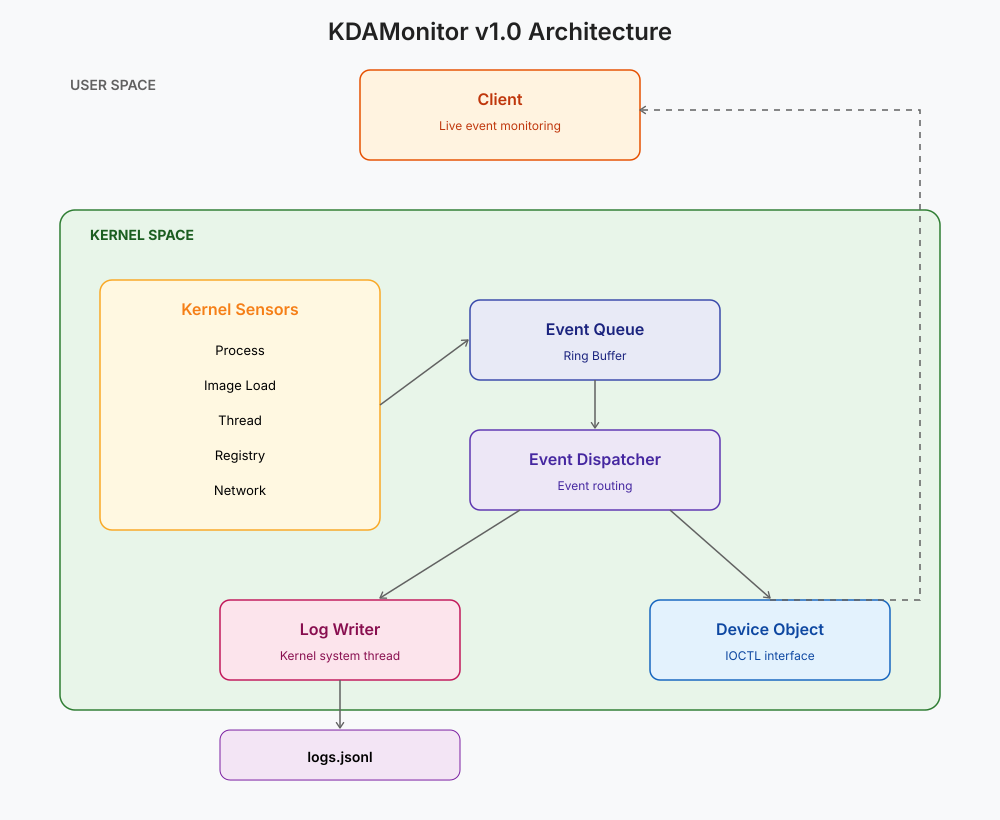

Welcome to the first series on my blog! It will serve both as an experiment for my upcoming article series and as a development journal for this project.

> The project can be found in this repository: [KDAMonitor](https://github.com/HalfTimeOfLife/KDAMonitor).

---

## What is KDAMonitor?

KDAMonitor stands for *Kernel Driver Activity Monitor*; the goal of this project is to roughly replicate what [Sysmon](https://learn.microsoft.com/en-us/sysinternals/downloads/sysmon) from Microsoft does.
This project will be made up of two components:
- The driver, which will collect events, log them to a `.jsonl` file, and send them to the client. Here is the list of events handled by the driver:
  - process creation/termination
  - image loading
  - network connections
  - registry modification/creation/deletion
  - thread creation/termination
- The client, which will be an interface (a console app at first) for the user to observe events in real time

The choice of these events is partly arbitrary, but it also reflects the basics of what's typically monitored in malware analysis: which process was launched, which DLLs were loaded, who the process communicates with over the network, etc.

---

## Why this project?

There are two main reasons why I decided to build this project rather than something else:

1. Learning to develop a driver for the Windows kernel
2. Building a useful tool for malware analysis that I can reuse myself (though nowhere near as capable as [Sysmon](https://learn.microsoft.com/en-us/sysinternals/downloads/sysmon))

This project stems from a simple desire to learn and discover something new. I figured that to monitor system activity, what better than a kernel driver, which has the ability to see everything?

*Note that while writing this article I'm already at version 0.7 of the project, so I already have some hindsight on it.*

Without further ado, let's move on to the architecture I had in mind for this project at the start.

---

## Planned Architecture

By the end of this project (at v1.0), the architecture will look like this:

In summary:

1. An event occurs (process, image, network connection, etc.).
2. A sensor (callbacks or callouts) captures the event.
3. The relevant sensor also adds the event to the queue.
4. The event is dequeued and dispatched to two destinations:
     - the log writer, which writes it to the `.jsonl` file
     - the client, for real-time display

---

## Technologies Used

| | |
|---|---|
| **Language** | C |
| **IDE / Build** | Visual Studio 2026 |
| **Driver model** | WDM |
| **Test environment** | Windows 11 VM (VirtualBox), test signing disabled |

> The technology choices will be explained throughout the series.

---

## Prerequisites

To properly follow this series, I recommend readers have a basic understanding of C and how the Windows kernel works internally.
I'm learning right along with you :-), so I'll do my best to make the articles as clear as possible.

---

## Detailed Development Plan

Below is a table outlining a detailed plan for each release of the project:

| Version | File(s) involved | Feature |
| ------- | ---------------------- | --------------------------------------------------- |
| v0.1    | `driver_entry.c`       | Driver skeleton (load/unload)       |
| v0.2    | `device.c`, `ioctl.c`  | Device + IOCTL                                      |
| v0.3    | `event_queue.c`        | Kernel event queue                             |
| v0.4    | `log_writer.c`         | Logging                                      |
| v0.5    | `process_callback.c`   | Process creation/termination monitoring |
| v0.6    | `image_callback.c`     | Image/DLL load monitoring           |
| v0.7    | `wfp_session.c`        | WFP session setup                     |
| v0.8    | `wfp_callout.c`        | Network connection monitoring                  |
| v0.9    | `registry_callback.c`  | Registry activity monitoring              |
| v0.10   | `thread_callback.c`    | Thread creation/termination monitoring   |
| v0.11   | -                      | Codebase structure cleanup                 |
| v0.12   | `client/`              | Usermode client                          |
| v1.0    | -                      | Stabilization + release                 |

---

## Upcoming Articles

> You can skip this section if you'd rather discover the articles as I write them. Also note that this schedule may change as development progresses.

This article serves as an introduction to the series; I'll now briefly outline the content of the upcoming articles. Below, in order, are the articles to come along with a short description of their content:

| Article | Version(s) | Title | Main content |
| ------: | :--------: | ----- | ----------------- |
| **02** | **v0.1 – v0.2** | **Building the Driver Foundation: DriverEntry, Device Object and IOCTL Communication** | Creating the driver skeleton, `DriverEntry`/`DriverUnload`, `DEVICE_OBJECT`, symbolic link, IOCTL, and a first test usermode client. |
| **03** | **v0.3** | **The Event Queue: Structure and Synchronization in the Kernel** | Designing the generic event structure, ring buffer, spinlock, queue, FIFO, unique identifiers, and first internal test. |
| **04** | **v0.4** | **Writing Events to Disk: JSONL Logging, Wake Events and the First Crash** | Implementing the logging thread, creating JSONL files, using `KEVENT` to remove polling, the first crash (IRQL) and its resolution. |
| **05** | **v0.5** | **The First Sensor: Monitoring Process Creation and Termination** | Using `PsSetCreateProcessNotifyRoutineEx`, integration into the event pipeline, JSON serialization, and the first real events. |
| **06** | **v0.6** | **The Second Sensor: Tracking Image and DLL Loads** | Adding `PsSetLoadImageNotifyRoutine`, retrieving information about loaded DLLs/EXEs, integration with the existing system. |
| **07** | **v0.7** | **Preparing Network Monitoring: Setting Up the WFP Session** | Introduction to the Windows Filtering Platform, opening the WFP session, creating the provider/sublayer, a second crash encountered and its fix. |
| **08** | **v0.8** | **Monitoring Network Connections with Windows Filtering Platform** | Developing the WFP callout, intercepting outbound network connections, collecting PIDs, IP addresses, ports, and protocols. |
| **09** | **v0.9** | **Monitoring Registry Activity with Registry Callbacks** | Implementing registry callbacks (`CmRegisterCallbackEx`), monitoring key/value creation, modification, and deletion. |
| **10** | **v0.10** | **Monitoring Thread Creation and Termination** | Adding the thread callback (`PsSetCreateThreadNotifyRoutine`), collecting thread creation and termination events. |
| **11** | **v0.11** | **Refactoring KDAMonitor: Organizing the Codebase for Scalability** | Reorganizing the project's folder structure, separating components, improving maintainability, and preparing for future growth. |
| **12** | **v0.12** | **Building a Usermode Client for Real-Time Event Monitoring** | Developing a console client that communicates with the driver via IOCTL to display events in real time. |
| **13** | **v1.0** | **KDAMonitor v1.0: Stabilization, Validation and Lessons Learned** | Validation against real samples in a VM, performance, project limitations, final documentation, development wrap-up, and future prospects. |

---

Thank you in advance to everyone who follows this series. If you have any questions, feedback, or just want to chat about the project, feel free to reach out by [email](mailto:ec.charbonnier@gmail.com) or on [LinkedIn](https://linkedin.com/in/elouan-charbonnier).

See you in the next article, where we'll actually start building the driver!