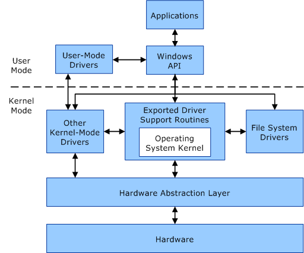

Bienvenue dans le deuxième article de la série sur le développement de KDAMonitor !

Dans cet article, je vais couvrir les versions v0.1 et v0.2 de ce projet. Pour rappel :

- **v0.1** : Base du driver (`DriverEntry`) et un court exemple
- **v0.2** : Ajout d'un device et communication IOCTL avec un exemple de client

Voici les fichiers concernés par cet article, et la section qui les explique :

| Fichier | Rôle | Section |
|---|---|---|
| `driver_entry.c` | Point d'entrée du driver, enregistrement des routines | [Qu'est-ce qu'un driver ?](#quest-ce-quun-driver-) |
| `device.c` | Création du device et du lien symbolique | [Comment communiquer avec le driver ?](#comment-communiquer-avec-le-driver-) |
| `ioctl.c` | Dispatch des IRP et traitement de l'IOCTL echo | [IOCTL](#ioctl) |
| `kdamon_shared.h` | Code IOCTL et structures partagées driver/client | [Anatomie d'un code IOCTL](#anatomie-dun-code-ioctl) |
| `kdamon_config.h` | Constantes centralisées (nom du device, du lien symbolique, tag de log) | - |
| `client/src/client.c` | Client usermode de test, valide l'échange echo | [Exemple : le client de test](#exemple--le-client-de-test) |

> Le projet peut être retrouvé dans ce dépôt : [KDAMonitor](https://github.com/HalfTimeOfLife/KDAMonitor).

---

## Qu'est-ce qu'un driver ?

Un driver (ou pilote en bon français) est un programme qui permet au système d'exploitation de communiquer avec les composants d'une machine. Sans pilote, le système d'exploitation ne saurait pas comment communiquer avec la carte graphique, la carte réseau, le clavier, la souris, etc. Sous Windows, ces programmes possèdent l'extension `.sys`.

Néanmoins, il existe des drivers qui ne servent pas qu'à la communication entre les composants et le système. En effet, on distingue plusieurs types de driver :
- les **drivers matériels** décrits ci-dessus
- les **drivers logiciels** qui sont des drivers qui ne dépendent pas d'un composant particulier

Par exemple, KDAMonitor est un **driver logiciel**, il ne dépend pas d'un composant physique de la machine sur laquelle il est installé.

On peut alors se demander quel est l'intérêt d'un driver par rapport à un exécutable classique (`.exe`). L'avantage principal d'un driver est qu'il s'exécute en kernel space, ce qui lui permet d'avoir des privilèges bien plus élevés, de pouvoir accéder directement à la mémoire physique, au matériel, et de n'être protégé par (presque) aucune des barrières de sécurité qui isolent normalement les processus usermode entre eux. Voici un diagramme illustrant la communication entre les composants user-mode et kernel-mode :


*Source : [Microsoft - User Mode and Kernel Mode](https://learn.microsoft.com/en-us/windows-hardware/drivers/gettingstarted/user-mode-and-kernel-mode)*

Concrètement, pour KDAMonitor, ce niveau de privilège va nous permettre d'observer des événements système (création de processus, connexions réseau, etc.) qu'une application standard (en usermode) ne peut pas observer. 

Cependant, bien qu'apportant beaucoup d'avantages, un driver vient avec quelques désagréments, notamment lorsqu'un crash se produit. Dans un exécutable classique, la plupart du temps, si le programme rencontre une erreur ou crash, le système continue sa vie. À l'inverse, une erreur dans un driver (crash, mauvais accès mémoire) peut faire planter tout le système (**Blue Screen Of Death (BSOD)**).

> Dans un article prochain, j'expliquerai le premier problème que j'ai rencontré qui a fait crasher la VM de test :-)

De plus, contrairement à un exécutable où il suffit de *cliquer* sur le fichier pour le lancer, un driver nécessite plus d'étapes. En effet, un driver est chargé dynamiquement dans l'espace mémoire du noyau par le **Windows I/O Manager**, via le **Service Control Manager (SCM)**.

Maintenant que la notion de driver est plus claire, je vais commencer par montrer comment créer un driver, pour cela, il faut d'abord comprendre la structure du programme.

### DriverEntry et DriverUnload

`DriverEntry` est le point d'entrée d'un driver, c'est l'équivalent d'un `main()` mais avec certaines différences. La signature standard de `DriverEntry` est :

```c
NTSTATUS DriverEntry(_In_ PDRIVER_OBJECT DriverObject, _In_ PUNICODE_STRING RegistryPath);
```
Voici une explication des arguments de la fonction :
- `DriverObject` : la structure représentant le driver dans le système
- `RegistryPath` : le chemin registre associé au driver

> Les annotations **\_In\_** font partie du *Source (Code) Annotation Language (SAL)*. Elles sont transparentes pour le compilateur, mais fournissent des métadonnées utiles pour les lecteurs humains et les outils d'analyse statique. Pour plus d'informations sur le SAL, voici la documentation Microsoft le concernant : [Understanding SAL](https://learn.microsoft.com/en-us/cpp/code-quality/understanding-sal?view=msvc-170).

`DriverEntry` **DOIT** retourner un `NTSTATUS`, cela peut prendre beaucoup de valeurs différentes, mais la plus importante est `STATUS_SUCCESS`. Si `DriverEntry` ne retourne pas `STATUS_SUCCESS` alors le chargement du driver échoue.

> Voir [2.3.1 NTSTATUS Values](https://learn.microsoft.com/en-us/openspecs/windows_protocols/ms-erref/596a1078-e883-4972-9bbc-49e60bebca55) pour la liste des valeurs possibles de `NTSTATUS`.

Et si on veut retirer proprement le driver ? Pour cela, on utilise la routine `DriverUnload` du `DriverObject` :

```c
DriverObject->DriverUnload = ...;
```

Cette routine est facultative, mais fortement recommandée afin que le driver soit proprement déchargé.

### Exemple : afficher la version de Windows

Dans le livre de Pavel Yosifovich, **Windows Kernel Programming**, un exercice est proposé. En se basant sur le squelette suivant de `DriverEntry`, il faut faire en sorte que le driver affiche via `KdPrint` la version du système Windows (major, minor et build number) en utilisant la fonction `RtlGetVersion` :

```c
#include "driver.h"

// DRIVER_TAG is defined in driver.h : #define DRIVER_TAG "[KDAMonitor]"

void DriverUnload(_In_ PDRIVER_OBJECT DriverObject)
{
  UNREFERENCED_PARAMETER(DriverObject);

  KdPrint((DRIVER_TAG " [SUCCESS]: Driver Unload called\n"));
}

NTSTATUS DriverEntry(_In_ PDRIVER_OBJECT DriverObject, _In_ PUNICODE_STRING RegistryPath)
{
  UNREFERENCED_PARAMETER(RegistryPath);
  DriverObject->DriverUnload = DriverUnload;

  KdPrint((DRIVER_TAG " [SUCCESS]: Initialized successfully\n"));
  return STATUS_SUCCESS;
}
```

Pour répondre à cet exercice, il faut utiliser la fonction `RtlGetVersion`, qui remplit une structure `RTL_OSVERSIONINFOW` contenant les informations de version recherchées. Un point important à ne pas oublier : le champ `dwOSVersionInfoSize` de cette structure doit être renseigné **avant** l'appel à `RtlGetVersion`, sans quoi la fonction échoue.

Voici le `DriverEntry` complété avec cette logique, juste avant le `return STATUS_SUCCESS` :

```c
NTSTATUS DriverEntry(_In_ PDRIVER_OBJECT DriverObject, _In_ PUNICODE_STRING RegistryPath)
{
	UNREFERENCED_PARAMETER(RegistryPath);
	DriverObject->DriverUnload = DriverUnload;

	KdPrint((DRIVER_TAG " [SUCCESS]: Initialized successfully\n"));

	RTL_OSVERSIONINFOW lpVersionInformation = { 0 };
	lpVersionInformation.dwOSVersionInfoSize = sizeof(lpVersionInformation);

	NTSTATUS status = RtlGetVersion(&lpVersionInformation);

	if (NT_SUCCESS(status))
	{
		KdPrint((DRIVER_TAG " [SUCCESS]: Windows %lu.%lu Build %lu\n",
			lpVersionInformation.dwMajorVersion,
			lpVersionInformation.dwMinorVersion,
			lpVersionInformation.dwBuildNumber
			));
	}
	else
	{
		KdPrint((DRIVER_TAG " [ERROR]: Windows version not found\n"));
	}

	return STATUS_SUCCESS;
}
```

> Pour plus d'info sur la fonction `RtlGetVersion`, voir la documentation microsoft : [RtlGetVersion function (wdm.h)](https://learn.microsoft.com/en-us/windows-hardware/drivers/ddi/wdm/nf-wdm-rtlgetversion).

On notera l'usage de la macro `NT_SUCCESS`, qui vérifie si un `NTSTATUS` représente un succès, cette macro sera utilisée tout au long de ce projet.

Enfin, un dernier détail important : les messages envoyés via `KdPrint` ne s'affichent **pas** dans une console classique. Ils ne sont visibles qu'à travers un débuggeur kernel comme **WinDbg**, ou un outil comme **DebugView** (Sysinternals). Par défaut, `KdPrint` ne fonctionne d'ailleurs qu'en build debug. Pour le reste du projet, je vais utiliser **DebugView**.

---

## Comment communiquer avec le driver ?

De par la séparation user/kernel qui existe dans les systèmes, le driver reste injoignable depuis l'espace utilisateur.

Pour l'instant, ce problème ne concerne pas notre driver, mais lorsqu'un client sera ajouté au projet il deviendra nécessaire de permettre au driver de communiquer avec ce client. Pour faire cela, nous avons besoin de créer un device. 

Un device est l'objet que le driver va exposer au reste du système à travers lequel les messages (entre driver et client) vont transiter.

Ces messages échangés entre le client et le driver prennent la forme d'I/O Request Packet (IRP), la structure de données standard que Windows utilise pour transmettre toute requête d'entrée/sortie à un driver. Chaque action (ouvrir le device, envoyer une commande, le fermer) génère un IRP différent, que le driver doit savoir traiter.

Dans le code, un device est une instance de la structure `DEVICE_OBJECT` et nous allons voir comment le créer.

### Créer un device avec IoCreateDevice

Pour créer un device, nous avons besoin de la fonction [IoCreateDevice](https://learn.microsoft.com/en-us/windows-hardware/drivers/ddi/wdm/nf-wdm-iocreatedevice). Voici ses paramètres les plus importants :

- `DriverObject` : le driver auquel le device sera "attaché"
- `DeviceName` : le nom kernel du device (pour KDAMonitor, `L"\\Device\\KDAMonitor"`)
- `DeviceType` : le type de device, `FILE_DEVICE_UNKNOWN` dans notre cas, puisque KDAMonitor n'est lié à aucun matériel spécifique
- `Exclusive` : si `TRUE`, un seul client peut ouvrir un handle à la fois ; `FALSE` autorise plusieurs connexions simultanées
- `DeviceObject` : reçoit en sortie le `DEVICE_OBJECT` nouvellement créé

Comme la plupart des fonctions kernel, elle retourne un `NTSTATUS` à vérifier.

`IoCreateDevice` laisse le flag `DO_DEVICE_INITIALIZING` actif sur le device créé, ce qui empêche tout client de l'ouvrir. Il faut le retirer explicitement une fois l'initialisation terminée :

```c
(*DeviceObject)->Flags &= ~DO_DEVICE_INITIALIZING;
```

Le device doit enfin être détruit avec `IoDeleteDevice` quand il n'est plus utilisé, c'est le rôle de `KdaMonDeleteDevice`, appelé depuis `DriverUnload`.

### Rendre le device accessible : IoCreateSymbolicLink

Même une fois créé, le device reste identifié uniquement par son nom kernel (`\Device\KDAMonitor`). Pour permettre à un client d'ouvrir ce device avec un simple `CreateFileW`, il faut faire le pont entre l'espace de noms kernel et l'espace de noms usermode. C'est le rôle de [IoCreateSymbolicLink](https://learn.microsoft.com/en-us/windows-hardware/drivers/ddi/wdm/nf-wdm-iocreatesymboliclink).

Cette fonction prend en paramètres :
- `SymbolicLinkName` : le nom accessible depuis l'espace utilisateur (par exemple `\DosDevices\KDAMonitor`, qu'un client ouvrira sous la forme `\\.\KDAMonitor`)
- `DeviceName` : le nom kernel du device visé, celui donné précédemment à `IoCreateDevice`

Elle retourne, comme d'habitude, un `NTSTATUS` à vérifier.

> Microsoft précise que cette fonction n'est en principe pas recommandée pour les drivers WDM : un vrai driver WDM devrait exposer son device via `IoRegisterDeviceInterface`.

Sans ce lien symbolique, le device existerait bien en mémoire, mais resterait complètement injoignable depuis n'importe quel programme usermode.

### Buffered I/O vs Direct I/O

> Cette section touche un peu à la structure IRP, présentée en détail dans la partie suivante. N'hésitez pas à la sauter pour lire la partie suivante.

Quand un client envoie ou reçoit des données via le device, il faut bien que ces données transitent quelque part entre l'espace utilisateur et l'espace kernel. Windows propose plusieurs méthodes pour ça, et notre driver utilise le flag `DO_BUFFERED_IO`.

Avec le **Buffered I/O**, le gestionnaire d'I/O (I/O Manager) alloue un buffer intermédiaire en mémoire kernel, copie les données du client vers ce buffer (ou l'inverse), puis rend ce buffer accessible au driver via `Irp->AssociatedIrp.SystemBuffer` (un champ de la structure IRP que je détaillerai dans la partie suivante). Le driver n'accède donc jamais directement à la mémoire du client.

L'alternative est le **Direct I/O** (`DO_DIRECT_IO`), qui utilise des *Memory Descriptor Lists* (MDL) pour laisser le driver accéder directement aux pages physiques du buffer client, sans copie intermédiaire. C'est plus rapide pour de gros volumes de données (car ça évite la copie), mais plus complexe à mettre en œuvre (un exemple est donné dans le livre de Pavel Yosifovich, *Windows Kernel Programming*, Chapitre 7).

Pour KDAMonitor, les échanges restent petits (un echo pour l'instant, des événements JSON plus tard), donc Buffered I/O est largement suffisant et bien plus simple à implémenter.

### Le tout assemblé : device.c

Voici à quoi ressemble `KdaMonCreateDevice` et `KdaMonDeleteDevice` une fois toutes ces briques réunies :

```c
#include "device.h"
#include "kdamon_config.h"
// KDAMON_DEVICE_NAME est défini dans le header kdamon_config.h : L"\\Device\\KDAMonitor"
// KDAMON_SYMLINK_NAME est défini dans le header kdamon_config.h : L"\\DosDevices\\KDAMonitor"

NTSTATUS KdaMonCreateDevice(_In_ PDRIVER_OBJECT DriverObject, _Outptr_ PDEVICE_OBJECT* DeviceObject)
{
	UNICODE_STRING devName = RTL_CONSTANT_STRING(KDAMON_DEVICE_NAME);
	UNICODE_STRING symLink = RTL_CONSTANT_STRING(KDAMON_SYMLINK_NAME);

	NTSTATUS status = IoCreateDevice(
		DriverObject,
		0,
		&devName,
		FILE_DEVICE_UNKNOWN,
		0,
		FALSE,
		DeviceObject
	);
	if (!NT_SUCCESS(status))
	{
		KdPrint((DRIVER_TAG " [ERROR]: IoCreateDevice failed (0x%08X)\n", status));
		return status;
	}

	(*DeviceObject)->Flags |= DO_BUFFERED_IO;

	status = IoCreateSymbolicLink(&symLink, &devName);
	if (!NT_SUCCESS(status))
	{
		KdPrint((DRIVER_TAG " [ERROR]: IoCreateSymbolicLink failed (0x%08X)\n", status));
		IoDeleteDevice(*DeviceObject);
		*DeviceObject = NULL;
		return status;
	}

	(*DeviceObject)->Flags &= ~DO_DEVICE_INITIALIZING;

	KdPrint((DRIVER_TAG " [SUCCESS]: Device object and symbolic link created\n"));
	return STATUS_SUCCESS;
}

void KdaMonDeleteDevice(_In_opt_ PDEVICE_OBJECT DeviceObject)
{
	UNICODE_STRING symLink = RTL_CONSTANT_STRING(KDAMON_SYMLINK_NAME);

	IoDeleteSymbolicLink(&symLink);

	if (DeviceObject != NULL)
	{
		IoDeleteDevice(DeviceObject);
	}

	KdPrint((DRIVER_TAG " [SUCCESS]: Device object and symbolic link deleted\n"));
}
```

---

## IOCTL

Un device ouvert ne suffit pas à lui seul : il faut encore un moyen pour qu'un client envoie une commande au driver, et que le driver y réponde. C'est le rôle des **IOCTL** (I/O Control), une requête générique qu'un programme usermode envoie à un driver via l'appel Win32 `DeviceIoControl`, en dehors des simples opérations de lecture/écriture classiques (`ReadFile`/`WriteFile`). C'est le mécanisme qui permet de définir des "commandes" propres à chaque driver. Dans notre cas, cela sera un simple echo pour commencer.

### Qu'est-ce qu'un IRP ?

Chaque fois qu'un client interagit avec le device (l'ouvrir, envoyer une commande, le fermer), Windows encapsule cette requête dans une structure appelée **I/O Request Packet (IRP)**.

> Pour plus d'informations sur cette structure, voici la documentation officielle : [IRP structure (wdm.h)](https://learn.microsoft.com/en-us/windows-hardware/drivers/ddi/wdm/ns-wdm-_irp).

C'est le gestionnaire d'I/O (I/O Manager) qui crée l'IRP et l'envoie au driver via la fonction `IoCallDriver`. Une fois la requête traitée, le driver signale sa complétion via `IoCompleteRequest`.

Un IRP est toujours accompagné d'au moins une structure **I/O Stack Location** (`IO_STACK_LOCATION`), qui contient les paramètres propres à la requête (le code IOCTL demandé, la taille du buffer, etc.). Pour y accéder, le driver utilise la macro `IoGetCurrentIrpStackLocation`.

C'est précisément dans l'IRP que réside le champ `SystemBuffer` mentionné dans la partie précédente : quand le code IOCTL utilise `METHOD_BUFFERED`, c'est via `Irp->AssociatedIrp.SystemBuffer` que le driver accède aux données envoyées par le client.

### Le dispatch des IRP (CREATE, CLOSE, DEVICE_CONTROL)

Chaque IRP contient un **code de fonction majeur** (`IRP_MJ_XXX`), qui indique au driver quelle opération accomplir. Pour chaque code que le driver souhaite gérer, il doit enregistrer une **routine de dispatch** correspondante, autrement dit, une fonction appelée automatiquement par le système dès qu'un IRP portant ce code arrive. Toutes les routines de dispatch partagent la même signature :

```c
NTSTATUS DriverDispatch(PDEVICE_OBJECT DeviceObject, PIRP Irp);
```

Cet enregistrement se fait dans `DriverEntry`, via le tableau `DriverObject->MajorFunction[...]`. Dans le cas de KDAMonitor, il faut rajouter cela dans `DriverEntry` :

```c
DriverObject->MajorFunction[IRP_MJ_CREATE] = KdaMonCreateClose;
DriverObject->MajorFunction[IRP_MJ_CLOSE] = KdaMonCreateClose;
DriverObject->MajorFunction[IRP_MJ_DEVICE_CONTROL] = KdaMonDeviceControl;
```

- `IRP_MJ_CREATE` correspond à un appel `CreateFile` côté client. La plupart des drivers se contentent de compléter l'IRP avec un statut de succès, ce qui est le cas de KDAMonitor à ce stade
- `IRP_MJ_CLOSE` est l'opposé, déclenché par `CloseHandle`
- `IRP_MJ_DEVICE_CONTROL` est le véritable point d'entrée de la communication : c'est via ce code que transitent toutes les requêtes `DeviceIoControl` du client, avec le code IOCTL demandé stocké dans l'`IO_STACK_LOCATION` de l'IRP

> Il y a d'autres routines de dispatch. Voici la documentation officielle : [DRIVER_DISPATCH callback function (wdm.h)](https://learn.microsoft.com/en-us/windows-hardware/drivers/ddi/wdm/nc-wdm-driver_dispatch).

Une fois qu'une routine de dispatch décide de traiter un IRP, elle doit impérativement le **compléter** via `IoCompleteRequest`.

### Anatomie d'un code IOCTL

Un **code IOCTL** est simplement une valeur numérique qui identifie une commande précise auprès du driver. Le code en question n'est donc pas aléatoire, il doit être construit via la macro `CTL_CODE`, qui encode plusieurs informations dans un seul entier 32 bits :

```c
#define CTL_CODE(DeviceType, Function, Method, Access) \
    (((DeviceType) << 16) | ((Access) << 14) | ((Function) << 2) | (Method))
```

- **DeviceType** : le type de device visé. Les valeurs 0–32767 sont réservées à Microsoft, 32768 (`0x8000`) et au-delà sont libres pour les développeurs tiers, c'est justement la valeur utilisée par `KDAMON_DEVICE_TYPE`
- **Function** : le code interne de l'opération demandée. Les valeurs 0–2047 sont réservées à Microsoft, 2048 (`0x800`) et au-delà sont libres, encore une fois la valeur de départ choisie pour `IOCTL_KDAMON_ECHO`
- **Method** : la méthode de transfert des buffers, `METHOD_BUFFERED`, déjà vu dans la partie précédente, ou les variantes Direct I/O (`METHOD_IN_DIRECT`, `METHOD_OUT_DIRECT`), ou encore `METHOD_NEITHER` où le driver reçoit directement des pointeurs bruts et doit les valider lui-même
- **Access** : le niveau d'accès requis pour envoyer cet IOCTL, `FILE_ANY_ACCESS` dans notre cas, qui n'impose aucune restriction particulière

Voici comment ces éléments se combinent dans `kdamon_shared.h` pour définir notre premier IOCTL, un simple echo :

```c
#define KDAMON_DEVICE_TYPE 0x8000
#define IOCTL_KDAMON_ECHO CTL_CODE(KDAMON_DEVICE_TYPE, 0x800, METHOD_BUFFERED, FILE_ANY_ACCESS)
```

Ce fichier définit aussi les structures de requête et réponse associées à cet IOCTL :

```c
typedef struct _KDAMON_ECHO_REQUEST
{
    ULONG Value;
} KDAMON_ECHO_REQUEST, * PKDAMON_ECHO_REQUEST;

typedef struct _KDAMON_ECHO_REPLY
{
    ULONG Value;
} KDAMON_ECHO_REPLY, * PKDAMON_ECHO_REPLY;
```

Ce fichier `kdamon_shared.h` est destiné à être **partagé** entre le driver et le client afin de garantir que les deux côtés s'accordent sur le même code IOCTL et les mêmes structures de données.

### Le tout assemblé : ioctl.c

Voici comment tous ces éléments (dispatch IRP, IRP_MJ_CREATE/CLOSE/DEVICE_CONTROL, I/O Stack Location, `SystemBuffer`, code IOCTL) s'assemblent concrètement dans `ioctl.c` :

```c
#include "ioctl.h"
#include "kdamon_shared.h"
#include "kdamon_config.h"

NTSTATUS KdaMonCreateClose(_In_ PDEVICE_OBJECT DeviceObject, _In_ PIRP Irp)
{
    UNREFERENCED_PARAMETER(DeviceObject);

    Irp->IoStatus.Status = STATUS_SUCCESS;
    Irp->IoStatus.Information = 0;
    IoCompleteRequest(Irp, IO_NO_INCREMENT);
    return STATUS_SUCCESS;
}

NTSTATUS KdaMonDeviceControl(_In_ PDEVICE_OBJECT DeviceObject, _In_ PIRP Irp)
{
    UNREFERENCED_PARAMETER(DeviceObject);

    PIO_STACK_LOCATION stack = IoGetCurrentIrpStackLocation(Irp);
    NTSTATUS status = STATUS_SUCCESS;
    ULONG_PTR information = 0;

    switch (stack->Parameters.DeviceIoControl.IoControlCode) {
    case IOCTL_KDAMON_ECHO:
    {
        ULONG inLen = stack->Parameters.DeviceIoControl.InputBufferLength;
        ULONG outLen = stack->Parameters.DeviceIoControl.OutputBufferLength;

        if (inLen < sizeof(KDAMON_ECHO_REQUEST) || outLen < sizeof(KDAMON_ECHO_REPLY))
        {
            status = STATUS_BUFFER_TOO_SMALL;
            break;
        }

        PKDAMON_ECHO_REQUEST request = (PKDAMON_ECHO_REQUEST)Irp->AssociatedIrp.SystemBuffer;

        KDAMON_ECHO_REPLY reply;
        reply.Value = request->Value;

        RtlCopyMemory(Irp->AssociatedIrp.SystemBuffer, &reply, sizeof(reply));
        information = sizeof(reply);
        break;
    }
    default:
        status = STATUS_INVALID_DEVICE_REQUEST;
        KdPrint((DRIVER_TAG " [ERROR]: Unknown IOCTL 0x%08X\n",
            stack->Parameters.DeviceIoControl.IoControlCode));
        break;
    }
    Irp->IoStatus.Status = status;
    Irp->IoStatus.Information = information;
    IoCompleteRequest(Irp, IO_NO_INCREMENT);

    return status;
}
```

Quelques points à noter sur ce code :

- `KdaMonCreateClose` gère à la fois `IRP_MJ_CREATE` et `IRP_MJ_CLOSE`
- `KdaMonDeviceControl` récupère d'abord l'`IO_STACK_LOCATION` courante via `IoGetCurrentIrpStackLocation`, pour accéder au code IOCTL demandé (`stack->Parameters.DeviceIoControl.IoControlCode`)
- Avant de traiter la requête, on vérifie que les buffers d'entrée et de sortie sont assez grands
- On accède aux données envoyées par le client via `Irp->AssociatedIrp.SystemBuffer`
- Comme Buffered I/O utilise le même buffer pour l'entrée et la sortie, on écrit directement la réponse par-dessus la requête reçue avec `RtlCopyMemory`
- Si le code IOCTL reçu ne correspond à rien de connu, on retourne `STATUS_INVALID_DEVICE_REQUEST`
- Dans tous les cas, la requête est complétée avec `IoCompleteRequest`, comme vu dans la partie sur le dispatch

---

## Exemple : le client de test

Ce client est volontairement minimal. Son seul but est de valider que la chaîne complète fonctionne : ouverture du device, envoi d'une requête IOCTL, réception de la réponse. Ce n'est pas le client final du projet, qui sera développé en détail dans l'article 12 (v0.12).

```c
#include <windows.h>
#include <stdio.h>
#include "..\include\client.h"
#include "..\..\driver\include\kdamon_shared.h"
// CLIENT_TAG is defined in client.h as : "[KDAMonitor-Client]"

int Error(const char* message) {
    printf(CLIENT_TAG " [ERROR]: %s (error=%lu)\n", message, GetLastError());
    return 1;
}

int main(int argc, const char* argv[]) {
    HANDLE hDevice = CreateFileW(
        L"\\\\.\\KDAMonitor",
        GENERIC_READ | GENERIC_WRITE,
        0,
        NULL,
        OPEN_EXISTING,
        0,
        NULL
    );

    if (hDevice == INVALID_HANDLE_VALUE)
    {
        return Error("Failed to open device");
    }

    printf(CLIENT_TAG " [SUCCESS]: Device opened successfully\n");

    KDAMON_ECHO_REQUEST request;
    request.Value = 42;

    KDAMON_ECHO_REPLY reply;
    DWORD bytesReturned = 0;

    BOOL success = DeviceIoControl(
        hDevice,
        IOCTL_KDAMON_ECHO,
        &request, sizeof(request),
        &reply, sizeof(reply),
        &bytesReturned,
        NULL
    );

    if (!success)
    {
        CloseHandle(hDevice);
        return Error("DeviceIoControl failed");
    }

    printf(CLIENT_TAG " [INFO]: Sent %lu, received %lu (bytes returned: %lu)\n",
        request.Value, reply.Value, bytesReturned);

    if (reply.Value == request.Value)
    {
        printf(CLIENT_TAG " [SUCCESS]: Echo matches\n");
    }
    else
    {
        printf(CLIENT_TAG " [ERROR]: Echo mismatch\n");
    }

    CloseHandle(hDevice);
    return 0;
}
```

Le déroulement est simple :

1. **Ouverture du device** via `CreateFileW` sur `\\.\KDAMonitor`, c'est ici que le lien symbolique créé dans `device.c` est utilisé et que l'IRP `IRP_MJ_CREATE` est déclenché côté driver
2. **Préparation de la requête** : une structure `KDAMON_ECHO_REQUEST` avec une valeur arbitraire (`42`)
3. **Envoi via `DeviceIoControl`**, avec le code `IOCTL_KDAMON_ECHO`, ce qui déclenche `IRP_MJ_DEVICE_CONTROL` côté driver, et fait entrer en jeu tout le mécanisme de dispatch vu précédemment
4. **Vérification** : si `reply.Value` correspond bien à la valeur envoyée, l'aller-retour usermode -> kernel -> usermode a fonctionné de bout en bout
5. **Fermeture du handle** via `CloseHandle`, qui déclenche `IRP_MJ_CLOSE`

Ce petit programme suffit à valider toute la mécanique construite dans cet article : device, lien symbolique, dispatch IRP, et traitement d'un IOCTL. Ci-dessous, un gif démontrant la fonctionnalité du projet :

<video controls width="100%">
  <source src="demo-echo.mp4" type="video/mp4">
</video>

> **Point d'attention** : le driver est compilé en configuration **Debug** (pour que les `KdPrint` fonctionnent), mais le client, lui, est compilé en **Release**. En Debug, le client compile correctement mais ne se lance pas (certaines DLL sont introuvables au démarrage). Le compiler en **Release** contourne le problème.

---

## Conclusion

Avec ces deux premières versions, KDAMonitor dispose maintenant du strict nécessaire pour exister en tant que driver : un point d'entrée (`DriverEntry`), un device accessible depuis l'espace utilisateur, et un premier échange IOCTL fonctionnel. 

Cet article est plus long que prévu, il sera peut-être raccourci ultérieurement.
> Les prochains articles seront moins longs :-) 

Merci d'avoir lu jusqu'au bout et à bientôt pour le prochain et troisième article de cette série : **La file d'événements : structure et synchronisation dans le noyau**.