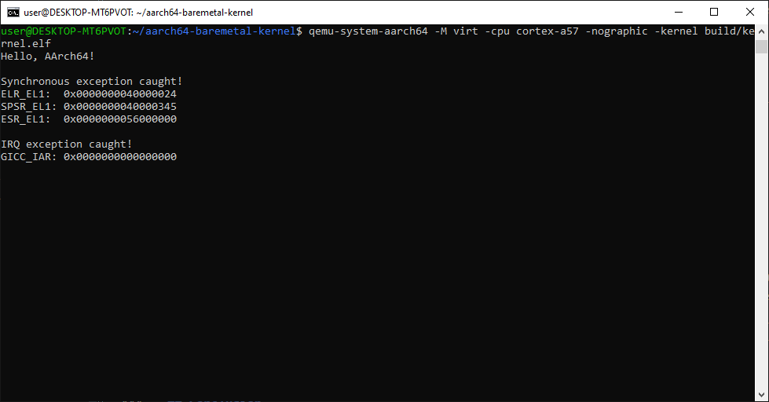

Bienvenue dans le troisième article de la série sur le développement de mon noyau AArch64 bare-metal !

Dans cet article, je vais présenter la version v0.2 de ce projet. Le but de cette version est d'implémenter les exceptions du noyau : obtenir un noyau capable de détecter et de gérer une exception synchrone (via `svc`) ainsi qu'une interruption matérielle asynchrone (IRQ), grâce à une table de vecteurs, un handler synchrone, un handler IRQ et le GIC (contrôleur d'interruptions).

Voici les fichiers concernés par cet article, et la section qui les explique :

| Fichier | Rôle | Section |
| --- | --- | --- |
| `src/exceptions/vectors.s` | Table de vecteurs d'exception | [Implémenter la table de vecteurs](#implémenter-la-table-de-vecteurs) |
| `src/exceptions/handlers.s` | Handlers synchrone et IRQ | [Le handler synchrone](#le-handler-synchrone) et [Le handler IRQ](#le-handler-irq-et-déclenchement-du-sgi) |
| `src/gic/gic.s`, `src/gic/gic.inc` | Driver GIC (`gic_init`) | [Le GIC et le handler IRQ](#le-gic-et-le-handler-irq) |
| `src/uart/uart.s` | Ajout de `uart_put_hex` | [`uart_put_hex`](#uart_put_hex) |
| `src/boot/boot.s` | Configuration `VBAR_EL1`, `gic_init`, déclenchement `svc`/SGI | [Déclencher l'exception synchrone](#déclencher-lexception-synchrone) et [Le GIC et le handler IRQ](#le-gic-et-le-handler-irq) |

> Le projet peut être retrouvé dans ce dépôt : [aarch64-baremetal-kernel](https://github.com/HalfTimeOfLife/aarch64-baremetal-kernel).

---

## Modèle d'exception AArch64

Cette section est fortement inspirée de la documentation officielle d'ARM : [Learn the architecture - AArch64 Exception Model](https://support.arm.com/documentation/102412/0103?lang=en).

### Exceptions synchrones et asynchrones

En AArch64, il existe deux types d'exceptions :

- les exceptions synchrones qui sont causées (ou liées) à l'instruction actuellement exécutée
- les exceptions asynchrones qui sont causées par un élément extérieur au flux d'instruction.

Une exception synchrone est directement provoquée par l'instruction en cours d'exécution : un appel système (`svc`), une instruction invalide, ou une faute mémoire par exemple. L'adresse de retour a une relation définie par l'architecture avec l'instruction fautive et ce type d'exception ne peut pas être masqué, autrement dit elle interrompt le flux d'instruction.

Une exception asynchrone provient d'un événement externe, par exemple : un timer, un périphérique ou un autre cœur. On parle alors d'interruption (IRQ, FIQ ou SError). Contrairement aux exceptions synchrones, les interruptions peuvent être masquées via le registre `PSTATE.DAIF`, et sont gérées via le GIC (*Generic Interrupt Controller*), qu'on détaillera plus loin dans cet article.

Dans cet article, on va provoquer et gérer un exemple de chaque type : un `svc` pour la partie synchrone, et un SGI (*Software-Generated Interrupt*) via le GIC pour la partie asynchrone.

Voici les registres utilisés pour gérer les exceptions :

| Registre | Rôle |
| --- | --- |
| `ELR_ELx` | Adresse de retour après l'exception |
| `ESR_ELx` | Cause de l'exception (synchrone/SError uniquement) |
| `SPSR_ELx` | `PSTATE` sauvegardé au moment de l'exception |
| `VBAR_ELx` | Adresse de base de la table de vecteurs |

> Le suffixe `x` dépend de l'EL courant. Ce noyau ne tournant qu'à `EL1`, on utilisera uniquement `ELR_EL1`, `ESR_EL1`, `SPSR_EL1` et `VBAR_EL1`.

`eret` restaure `PSTATE` depuis `SPSR_ELx` et fait sauter le CPU à l'adresse contenue dans `ELR_ELx`, de manière atomique. Pour un `svc`, `ELR_EL1` contient l'adresse de l'instruction *suivant* le `svc`.

### La table de vecteurs

Chaque `EL` possède sa propre table de vecteurs, dont l'adresse est indiquée par `VBAR_ELx`. Cette table contient 16 entrées de 128 octets (ce qui donne 32 instructions) chacune, et doit être alignée sur 2 Ko.

| Offset | Type | Source |
| --- | --- | --- |
| `+0x000` | Synchronous | current EL, SP_EL0 |
| `+0x080` | IRQ | current EL, SP_EL0 |
| `+0x180` | SError | current EL, SP_EL0 |
| `+0x200` | **Synchronous** | **current EL, SP_ELx** |
| `+0x280` | **IRQ** | **current EL, SP_ELx** |
| `+0x380` | SError | current EL, SP_ELx |
| `+0x400` à `+0x780` | (lower EL, AArch64/AArch32) | non utilisées |

Ce noyau ne tourne qu'à `EL1`, sans `EL0`. Seules les deux entrées en gras (`+0x200`, `+0x280`) nous concernent, le reste sera composé de stubs.

---

## Implémenter la table de vecteurs

Pour implémenter la table de vecteurs, je me suis inspiré du fichier [11_exceptions_part1_groundwork/src/_arch/aarch64/exception.s](https://github.com/rust-embedded/rust-raspberrypi-OS-tutorials/blob/master/11_exceptions_part1_groundwork/src/_arch/aarch64/exception.s) dans le dépôt [rust-raspberrypi-OS-tutorials](https://github.com/rust-embedded/rust-raspberrypi-OS-tutorials/).

### Les macros `CALL_HANDLER` et `UNUSED_VECTOR`

Dans un nouveau fichier `src/exceptions/vectors.s`, on va créer plusieurs composants :

- Tout d'abord, une macro qui va appeler le `handler` correct lié à l'exception demandée :

```asm
.macro CALL_HANDLER handler
vector_\handler:
    mrs x19,  ELR_EL1
    mrs x20,  SPSR_EL1
    mrs x21,  ESR_EL1

    mov x0, sp

    bl \handler
.endm
```

Cette macro `CALL_HANDLER` sauvegarde `ELR`/`SPSR`/`ESR` dans des registres `callee-saved` (`x19`-`x21`) avant d'appeler le vrai handler, avec `sp` passé en `x0`.

- Ensuite, il faut une macro qui va servir de `handler` pour toutes les autres exceptions non implémentées :

```asm
.macro UNUSED_VECTOR
1:
    wfe
    b   1b
.endm
```

La macro `UNUSED_VECTOR` utilise un label numérique local pour pouvoir être expansée plusieurs fois sans collision de symboles.

### Alignement et `.org`

Ensuite, on va établir la table de vecteurs :

```asm
.align 11

_exception_vector_table:
.org 0x000
    UNUSED_VECTOR
.org 0x080
    UNUSED_VECTOR
...

.org 0x200
    CALL_HANDLER el_synchronous
.org 0x280
    CALL_HANDLER el_irq
...

.org 0x800
```

Au début, on aligne la table sur **2048 octets (2 KiB)**, comme l'exige `VBAR_EL1`.

Ensuite, `.org` permet de placer chaque entrée à l'offset exact attendu dans la table, en avançant le compteur de position de l'assembleur si nécessaire.

La plupart des entrées de cette table renvoient vers `UNUSED_VECTOR`. Dans notre cas, les deux entrées qui nous intéressent sont celles aux offsets `0x200` et `0x280`, où l'on place respectivement `CALL_HANDLER el_synchronous` et `CALL_HANDLER el_irq`.

---

## Déclencher l'exception synchrone

### `uart_put_hex`

Avant de rajouter l'exception synchrone, il faut rajouter dans `src/uart/uart.s`, une fonction permettant d'afficher (via l'UART) une chaîne hexadécimale de 64 bits :

```asm
uart_put_hex:
    stp x19, x20, [sp, #-32]!
    stp x30, xzr, [sp, #16]

    mov x19, x0
    mov x20, #16

hex_loop:
    lsr x3, x19, #60
    and x3, x3, #0xF

    ldr x2, =hex_chars
    ldrb w0, [x2, x3]
    bl uart_putc

    lsl x19, x19, #4

    subs x20, x20, #1
    b.ne hex_loop

    ldp x30, xzr, [sp, #16]
    ldp x19, x20, [sp], #32
    ret

hex_chars:
    .asciz "0123456789ABCDEF"
```

Cette fonction est nécessaire car `uart_puts` ne gère que de l'ASCII, or l'idée est d'afficher la valeur des registres lors de chaque exception.

### Le `handler` synchrone

Dans `src/exceptions/handlers.s`, on définit `el_synchronous`, la fonction appelée par `CALL_HANDLER`. Le `handler` ne doit pour l'instant faire qu'afficher des informations. Il commence par afficher `Synchronous exception caught!\n` lorsqu'il est appelé puis il va afficher les valeurs dans `ELR_EL1`, `SPSR_EL1` et `ESR_EL1`.

```asm
el_synchronous:
    stp x29, x30, [sp, #-16]!

    ldr x0, =message_synchronous
    bl uart_puts

    ldr x0, =message_prefix_elr_el1
    bl uart_puts
    mov x0, x19
    bl uart_put_hex

    ldr x0, =message_prefix_spsr_el1
    bl uart_puts
    mov x0, x20
    bl uart_put_hex

    ldr x0, =message_prefix_esr_el1
    bl uart_puts
    mov x0, x21
    bl uart_put_hex

    ldp x29, x30, [sp], #16
    eret
```

`x19`, `x20` et `x21`, remplis par `CALL_HANDLER`, survivent aux appels `uart_puts`/`uart_put_hex` puisque ce sont des registres callee-saved. Le `eret` final permet de reprendre l'exécution juste après l'instruction ayant déclenché l'exception.

Il ne reste plus qu'à configurer `VBAR_EL1` et à déclencher l'exception. Dans `src/boot/boot.s` :

```asm
ldr x0, =_exception_vector_table
msr vbar_el1, x0

...

svc #0
```

`VBAR_EL1` doit être configuré avant toute instruction pouvant lever une exception. Le `svc #0` provoque ensuite volontairement une exception synchrone, qui va être interceptée à l'offset `+0x200` de la table de vecteurs.

### Résultat

```bash
qemu-system-aarch64 -M virt -cpu cortex-a57 -nographic -kernel build/kernel.elf
```

```text
Hello, AArch64!

Synchronous exception caught!
ELR_EL1:  0x0000000040000024
SPSR_EL1: 0x0000000040000345
ESR_EL1:  0x0000000056000000
```

- `ESR_EL1`, bits [31:26] (champ `EC`) = `0x15`, la classe d'exception correspondant à un `SVC` en AArch64.

> Voir [ARM A64 Instruction Set - SVC](https://developer.arm.com/documentation/ddi0602/latest/Base-Instructions/SVC--Supervisor-call-).

- `SPSR_EL1`, bits [3:0] = `0x5` = `EL1h` (`EL1`, `SP_ELx`).

> Voir [ARM AArch64 System Registers - SPSR_EL1](https://developer.arm.com/documentation/ddi0601/latest/AArch64-Registers/SPSR-EL1--Saved-Program-Status-Register--EL1-).

- `ELR_EL1` (`0x40000024`) correspond bien à l'adresse de l'instruction suivant le `svc #0` (`0x40000020`) dans `boot.s`, vérifiable via `aarch64-none-elf-objdump -d build/kernel.elf` :

```text
0000000040000000 <_start>:
    ...
    4000001c:   d50342ff        msr     daifclr, #0x2
    40000020:   d4000001        svc     #0x0
    40000024:   58000160        ldr     x0, 40000050 <_start+0x50>
    ...
```

---

## Le GIC et le handler IRQ

Encore une fois, pour cette partie, je me suis basé sur la documentation officielle d'ARM : [Arm Generic Interrupt Controller Architecture Specification (GICv2)](https://developer.arm.com/documentation/ihi0048/latest/). QEMU `virt` avec `cortex-a57` implémente un GICv2.

### Distributeur et interface CPU

Le GIC (*Generic Interrupt Controller*) est le contrôleur d'interruptions standard d'ARM : une ressource centralisée entre toutes les sources d'interruptions possibles et le CPU.

Le GIC se découpe en deux blocs :

| Bloc | Rôle | Préfixe |
| --- | --- | --- |
| Distributeur | Centralise les sources, priorise | `GICD_*` |
| Interface CPU | Masquage de priorité par processeur | `GICC_*` |

Le cycle de vie d'une interruption suit trois étapes :

1. **Acknowledge** : lecture de `GICC_IAR`, qui retourne l'ID de l'interruption en attente et la passe à l'état actif.
2. **Handle** : le handler s'exécute.
3. **Complete** : écriture de la même valeur dans `GICC_EOIR`.

### Trouver `GICD_BASE` / `GICC_BASE`

Comme pour l'UART, il faut trouver l'adresse de base de ces deux composants (le distributeur et l'interface) :

```bash
qemu-system-aarch64 -M virt -cpu cortex-a57 -machine dumpdtb=virt.dtb -nographic
dtc -I dtb -O dts virt.dtb | grep -A 5 intc
```

On obtient :

```text
        intc@8000000 {
                phandle = <0x8002>;
                reg = <0x00 0x8000000 0x00 0x10000 0x00 0x8010000 0x00 0x10000>;
                compatible = "arm,cortex-a15-gic";
                ranges;
                #size-cells = <0x02>;
```

D'après le [device tree standard `arm,gic`](https://github.com/torvalds/linux/blob/master/Documentation/devicetree/bindings/interrupt-controller/arm%2Cgic.yaml), le Distributeur est listé en premier dans `reg` :

| Registre | Adresse |
| --- | --- |
| `GICD_BASE` | `0x08000000` |
| `GICC_BASE` | `0x08010000` |

> Ces adresses sont confirmées directement dans le code source de QEMU : [hw/arm/virt.c](https://github.com/qemu/qemu/blob/master/hw/arm/virt.c) définit `VIRT_GIC_DIST` à `0x08000000` et `VIRT_GIC_CPU` à `0x08010000`.

### `gic_init`

Les offsets des registres utilisés sont regroupés dans un fichier séparé, `src/gic/gic.inc`, afin d'être partagés entre plusieurs fichiers `.s` :

```asm
.equ GICD_BASE,       0x08000000
.equ GICC_BASE,       0x08010000
.equ GICD_CTLR,       0x000
.equ GICD_ISENABLER0, 0x100
.equ GICD_SGIR,       0xF00
.equ GICC_CTLR,       0x000
.equ GICC_PMR,        0x004
.equ GICC_IAR,        0x00C
.equ GICC_EOIR,       0x010
```

Dans `src/gic/gic.s` :

```asm
gic_init:
    ldr x0, =GICD_BASE
    mov w1, #0x1
    str w1, [x0, #GICD_CTLR]      // enable Group 0 forwarding

    ldr x0, =GICD_BASE
    mov w2, #0x1
    str w2, [x0, #GICD_ISENABLER0] // enable SGI 0

    ldr x0, =GICC_BASE
    mov w3, #0xFF
    str w3, [x0, #GICC_PMR]        // let all priorities through

    ldr x0, =GICC_BASE
    mov w4, #0x1
    str w4, [x0, #GICC_CTLR]       // enable Group 0 signaling

    ret
```

`.include` colle littéralement le contenu de `gic.inc` dans le fichier au moment de l'assemblage. C'est nécessaire ici car un offset utilisé en immédiat (`[x0, #GICD_CTLR]`) doit être connu de l'assembleur dès l'assemblage, pas seulement au link. Le Makefile passe `-Isrc` pour que `.include "gic/gic.inc"` se résolve relativement à `src/`.

`gic_init` configure donc quatre choses :

- l'activation du forwarding des interruptions `Group 0` au niveau du Distributeur
- l'activation du `SGI 0`
- le masque de priorité de l'interface CPU (`0xFF` = tout laisse passer)
- et l'activation de la signalisation `Group 0` côté interface CPU.

Cette fonction est appelée une fois, tôt dans `_start`, dans `src/boot/boot.s` :

```asm
bl gic_init
```

### Le handler IRQ et déclenchement du SGI

Le `handler` IRQ va faire à peu près la même chose que le `handler` synchrone (afficher un message et un registre en hexadécimal, puis `eret`). Cependant, il n'y a qu'un seul registre à afficher (`GICC_IAR`) et il faut gérer le cycle **Acknowledge**/**Complete** du GIC vu plus haut :

```asm
el_irq:
    stp x22, x30, [sp, #-16]!

    ldr x0, =GICC_BASE
    ldr w22, [x0, #GICC_IAR]       // moves the interrupt to active

    ldr x0, =message_irq
    bl uart_puts
    ldr x0, =message_prefix_iar
    bl uart_puts
    mov x0, x22
    bl uart_put_hex

    ldr x0, =GICC_BASE
    str w22, [x0, #GICC_EOIR]      // write back the exact value read

    ldp x22, x30, [sp], #16
    eret
```

`x22` est utilisé plutôt que `x19`-`x21` (déjà réservés par `CALL_HANDLER` pour `ELR_EL1`/`SPSR_EL1`/`ESR_EL1`) afin de conserver la valeur de `GICC_IAR` à travers les appels à `uart_puts`/`uart_put_hex`.

On commence par démasquer les IRQ, masquées par défaut au reset. Toujours dans `src/boot/boot.s` :

```asm
msr daifclr, #2
```

> Voir [ARM AArch64 System Registers - DAIF](https://developer.arm.com/documentation/ddi0601/latest/AArch64-Registers/DAIF--Interrupt-Mask-Bits).

Puis, dans `src/boot/boot.s`, écrire dans `GICD_SGIR` pour déclencher le SGI :

```asm
ldr x0, =GICD_BASE
mov w1, #0x2000000
str w1, [x0, #GICD_SGIR]
```

`0x2000000` encode `TargetListFilter = 0b10` (bits [25:24], cible le processeur courant uniquement) combiné à l'ID de SGI `0` (bits [3:0]). Cette écriture déclenche immédiatement l'interruption, qui est prise en charge à l'offset `+0x280` de la table de vecteurs.

> Voir [GICv2 Architecture Specification](https://developer.arm.com/documentation/ihi0048/latest/) pour l'encodage de `GICD_SGIR` (`TargetListFilter` en bits [25:24], ID de SGI en bits [3:0]).

---

## Compiler et vérifier

On commence par compiler et vérifier que les symboles attendus sont bien présents :

```bash
make clean && make
aarch64-none-elf-nm build/kernel.elf | grep -E "exception_vector_table|el_irq|el_synchronous|gic_init"
```

```text
0000000040000800 T _exception_vector_table
00000000400000a4 T el_irq
0000000040000058 T el_synchronous
0000000040001000 T gic_init
0000000040000a80 t vector_el_irq
0000000040000a00 t vector_el_synchronous
```

`_exception_vector_table` se trouve à l'adresse `0x40000800`, un multiple de `0x800` (2048), ce qui confirme que l'alignement sur 2 Ko demandé par `VBAR_EL1` a bien été respecté par le linker.

> On retrouve aussi `vector_el_synchronous` et `vector_el_irq`, les labels locaux générés respectivement par `CALL_HANDLER el_synchronous` et `CALL_HANDLER el_irq`, à `0x40000800 + 0x200 = 0x40000a00` et `0x40000800 + 0x280 = 0x40000a80`. Les deux entrées étant bien routées à leurs offsets attendus dans la table, on en conclut que tout est bon.

Enfin, on lance le kernel avec QEMU :



---

## Conclusion

Le noyau a maintenant sa propre table de vecteurs (qu'il faut encore peupler) ainsi que des `handlers` rudimentaires pour les vecteurs implémentés.

Merci d'avoir lu jusqu'au bout, et à bientôt pour le prochain article : **Mettre en place le timer ARM**.
