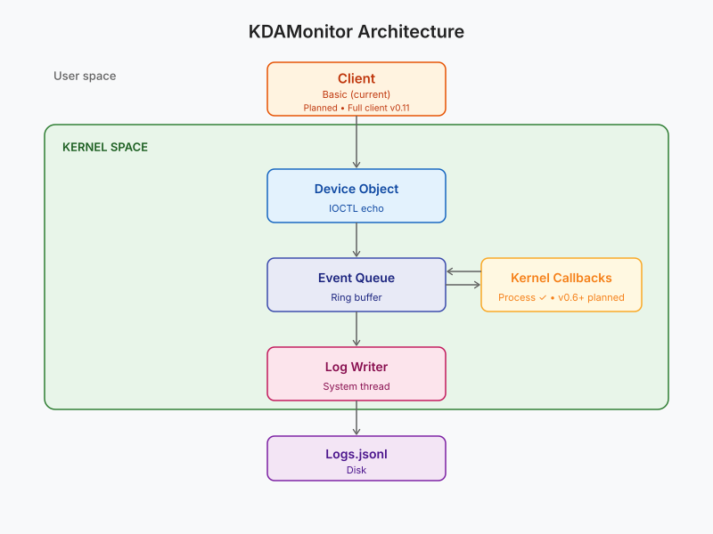

Bienvenue dans le cinquième article de la série sur le développement de KDAMonitor !

Dans cet article, je vais couvrir la version v0.5 de ce projet. Dans cette version, j'implémente le premier des 5 capteurs/callbacks du projet : le capteur des processus.

Voici les fichiers concernés par cet article, et la section qui les explique :

| Fichier | Rôle | Section |
| --- | --- | --- |
|`event_types.h` | Nouveau type `KDAMON_PROCESS_EVENT_DATA` + union dans `KDAMON_EVENT` | [Que récupérer lors de la création ou terminaison d'un processus ?](#que-récupérer-lors-de-la-création-ou-terminaison-dun-processus-) |
| `process_callback.h` | Déclaration du register/unregister | [Implémenter le callback](#implémenter-le-callback) |
| `process_callback.c` | Le callback lui-même + logique création/terminaison | [Implémenter le callback](#implémenter-le-callback) |
| `log_writer.c` | Sérialisation JSONL spécifique aux événements de processus | [Sérialiser les événements processus en JSONL](#sérialiser-les-événements-processus-en-jsonl) |
| `driver_entry.c` | Enregistrement/désenregistrement du callback au chargement/déchargement | [Intégration dans `driver_entry.c`](#intégration-dans-driver_entryc) |

> Le projet peut être retrouvé dans ce dépôt : [KDAMonitor](https://github.com/HalfTimeOfLife/KDAMonitor).

---

## Que récupérer lors de la création ou terminaison d'un processus ?

Comme expliqué dans l'article 04, le driver utilisera une structure générique pour les événements avec une union qui donnera les informations spécifiques à chaque type d'événement. La structure de chaque événement est dans `event_types.h` et suivra la forme suivante :

```c
typedef struct _KDAMON_<TYPE_OF_EVENT>_EVENT_DATA
{
  // The event's data
} KDAMON_<TYPE_OF_EVENT>_EVENT_DATA;
```

Qu'est ce qui est intéressant dans un événement concernant un processus ?

J'ai choisi de retenir quatre informations :

- l'ID du processus (`ProcessId`) : un `HANDLE` du processus qui est créé ou terminé
- l'ID du parent du processus (`ParentProcessId`) : un `HANDLE` du processus qui a créé ou terminé le processus actuel
- le nom de l'image du processus (`ImageFileName`) : une chaîne de caractères (de `WCHAR`) contenant le nom de l'image complète du processus actuel 
- le statut du processus (`IsCreate`) : un `BOOLEAN` déterminant si le processus est créé (`TRUE`) ou terminé (`FALSE`)

Ces quatre paramètres sont suffisants pour décrire et différencier un processus.

Voici donc la structure représentant un événement de processus dans le driver :

```c
typedef struct _KDAMON_PROCESS_EVENT_DATA
{
	HANDLE ProcessId;
	HANDLE ParentProcessId;
	BOOLEAN IsCreate;
	WCHAR ImageFileName[260];
} KDAMON_PROCESS_EVENT_DATA;
```

> Le *magic number* `260` correspond à la longueur maximale des chemins dans Windows et sera changé en une macro dans une version ultérieure :)

---

## Qu'est-ce qu'un callback ?

Dans l'article 2, j'ai implémenté le client ainsi que la communication avec le driver. Mais ici ce qu'on cherche à faire c'est que le driver détecte automatiquement certains comportements, ici la création et la terminaison de processus.

Pour faire cela, le noyau Windows propose les **callbacks**. Le principe est le suivant : on donne au noyau un pointeur vers une fonction, en lui demandant de l'exécuter automatiquement quand une certaine condition survient.

Pour la création/terminaison de processus, la fonction dédiée est `PsSetCreateProcessNotifyRoutineEx`, qui sera détaillée dans la section suivante.

---

## Implémenter le callback

Cette partie va expliquer l'implémentation dans le driver des callbacks, tout est dans le fichier `process_callback.c`. Il y a trois fonctions dans ce fichier, dont deux sont exposées dans le header. Commençons par ces deux-là :

- `NTSTATUS KdaMonProcessCallbackRegister(VOID);` : la fonction utilisée dans `driver_entry.c` pour enregistrer le callback

- `VOID KdaMonProcessCallbackUnregister(VOID);` : la fonction utilisée dans `driver_entry.c` pour désenregistrer le callback

Et la fonction privée appelée lors de la création/terminaison d'un nouveau process :

```c
static VOID KdaMonProcessNotifyRoutine(
    _Inout_ PEPROCESS Process, 
    _In_ HANDLE ProcessId, 
    _Inout_opt_ PPS_CREATE_NOTIFY_INFO CreateInfo
);
```

La signature de cette fonction suit la forme suivante :

```c
PCREATE_PROCESS_NOTIFY_ROUTINE_EX PcreateProcessNotifyRoutineEx;

VOID PcreateProcessNotifyRoutineEx(
  [_Inout_]           PEPROCESS Process,
  [in]                HANDLE ProcessId,
  [in, out, optional] PPS_CREATE_NOTIFY_INFO CreateInfo
)
{...}
```

> Voir la documentation microsoft pour [PCREATE_PROCESS_NOTIFY_ROUTINE_EX](https://learn.microsoft.com/en-us/windows-hardware/drivers/ddi/ntddk/nc-ntddk-pcreate_process_notify_routine_ex), la routine utilisée par [PsSetCreateProcessNotifyRoutineEx](https://learn.microsoft.com/en-us/windows-hardware/drivers/ddi/ntddk/nf-ntddk-pssetcreateprocessnotifyroutineex)

### La routine de notification

Tout d'abord, il faut définir la routine appelée lors de la création et de la terminaison d'un processus. La signature de cette routine nous donne trois informations :

- `PEPROCESS Process` : Un pointeur vers la structure représentant le processus
- `HANDLE ProcessId` : L'ID du processus
- `PPS_CREATE_NOTIFY_INFO CreateInfo` : Un pointeur vers la structure [PS_CREATE_NOTIFY_INFO](https://learn.microsoft.com/en-us/windows-hardware/drivers/ddi/ntddk/ns-ntddk-_ps_create_notify_info) qui donne des informations sur le processus

> `CreateInfo` n'est rempli que si le processus est créé : en cas de terminaison, ce pointeur vaut simplement `NULL`.

Au début de cette routine, il faut créer l'événement de type `KdaMonEventProcess` :

```c
KDAMON_EVENT Event = { 0 };
Event.Type = KdaMonEventProcess;
KeQuerySystemTimePrecise(&Event.Timestamp);

// ProcessId est déjà donné dans la signature de la fonction !
Event.Data.Process.ProcessId = ProcessId;
```

Il faut ensuite distinguer deux cas : la création et la terminaison d'un processus.

#### Création de processus

Lors de la création du processus, il est possible de remplir toute la structure de l'événement (`KDAMON_EVENT Event`). Il suffit de récupérer les informations disponibles à partir des structures passées en arguments :

```c
if (CreateInfo) {
  // --- Process creation case ---
  Event.Data.Process.ParentProcessId = CreateInfo->ParentProcessId;
  Event.Data.Process.IsCreate = TRUE;

  PCUNICODE_STRING ImageFileName = CreateInfo->ImageFileName;

  if (ImageFileName && ImageFileName->Buffer != NULL) {
    SIZE_T MaxCopyLength = sizeof(Event.Data.Process.ImageFileName) - sizeof(WCHAR);
    SIZE_T ImageFileNameLength = (ImageFileName->Length < MaxCopyLength) ? ImageFileName->Length : MaxCopyLength;
    RtlCopyMemory(Event.Data.Process.ImageFileName, ImageFileName->Buffer, ImageFileNameLength);
    Event.Data.Process.ImageFileName[ImageFileNameLength / sizeof(WCHAR)] = L'\0';
  }
}
```

#### Terminaison de processus

Lors de la terminaison du processus, on ne peut récupérer que le `ProcessId` et donc mettre `IsCreate` à `FALSE`. Dans le code, on a :

```c
    else {
		// --- Process termination case ---
		Event.Data.Process.ParentProcessId = NULL;
		Event.Data.Process.IsCreate = FALSE;
		Event.Data.Process.ImageFileName[0] = L'\0';
    }
```

Dans les deux cas, une fois la structure `Event` remplie, on l'ajoute à la file avec `KdaMonEventQueuePush(&Event);`.

#### Code complet de `KdaMonProcessNotifyRoutine`

```c
static VOID KdaMonProcessNotifyRoutine(_Inout_ PEPROCESS Process, _In_ HANDLE ProcessId, _Inout_opt_ PPS_CREATE_NOTIFY_INFO CreateInfo)
{
	UNREFERENCED_PARAMETER(Process);

	KDAMON_EVENT Event = { 0 };
	Event.Type = KdaMonEventProcess;
	KeQuerySystemTimePrecise(&Event.Timestamp);

	Event.Data.Process.ProcessId = ProcessId;

    if (CreateInfo) {
		// --- Process creation case ---
		Event.Data.Process.ParentProcessId = CreateInfo->ParentProcessId;
		Event.Data.Process.IsCreate = TRUE;

		PCUNICODE_STRING ImageFileName = CreateInfo->ImageFileName;

		if (ImageFileName && ImageFileName->Buffer != NULL) {
			SIZE_T MaxCopyLength = sizeof(Event.Data.Process.ImageFileName) - sizeof(WCHAR);
			SIZE_T ImageFileNameLength = (ImageFileName->Length < MaxCopyLength) ? ImageFileName->Length : MaxCopyLength;
			RtlCopyMemory(Event.Data.Process.ImageFileName, ImageFileName->Buffer, ImageFileNameLength);
			Event.Data.Process.ImageFileName[ImageFileNameLength / sizeof(WCHAR)] = L'\0';
		}
    }
    else {
		// --- Process termination case ---
		Event.Data.Process.ParentProcessId = NULL;
		Event.Data.Process.IsCreate = FALSE;
		Event.Data.Process.ImageFileName[0] = L'\0';
    }
	KdaMonEventQueuePush(&Event);
}
```

### Enregistrer et désenregistrer le callback

Comme expliqué dans [Qu'est-ce qu'un callback ?](#quest-ce-quun-callback-), on utilise `PsSetCreateProcessNotifyRoutineEx` aussi bien pour enregistrer le callback que pour le désenregistrer (le paramètre `Remove` inverse simplement le sens de l'appel) :

```c
NTSTATUS KdaMonProcessCallbackRegister(VOID)
{
	NTSTATUS status = PsSetCreateProcessNotifyRoutineEx(KdaMonProcessNotifyRoutine, FALSE);
	if (!NT_SUCCESS(status))
	{
		KdPrint((DRIVER_TAG "[ERROR] PsSetCreateProcessNotifyRoutineEx failed: 0x%08X\n", status));
	}
    return status;
}

VOID KdaMonProcessCallbackUnregister(VOID)
{
    NTSTATUS status = PsSetCreateProcessNotifyRoutineEx(KdaMonProcessNotifyRoutine, TRUE);
    if (!NT_SUCCESS(status))
    {
		KdPrint((DRIVER_TAG "[ERROR] PsSetCreateProcessNotifyRoutineEx failed: 0x%08X\n", status));
    }
}
```

---

## Sérialiser les événements processus en JSONL

Comme expliqué dans l'article 04, chaque événement a son propre type de sérialisation en JSONL, avec sa fonction dédiée. Voici celle pour les processus :

```c
static NTSTATUS KdaMonLogWriterWriteProcessEvent(_In_ const KDAMON_EVENT* Event, _Out_writes_z_(BufferSize) PSTR EventBuffer, _In_ SIZE_T BufferSize)
{
    CHAR EscapedImage[520];
    CHAR PpidField[16];

    if (!KdaMonJsonEscapeW(Event->Data.Process.ImageFileName, EscapedImage, sizeof(EscapedImage)))
    {
        KdPrint((DRIVER_TAG " [WARNING]: Image path truncated during JSON escape (event %lu)\n", Event->Id));
    }

    if (Event->Data.Process.IsCreate && Event->Data.Process.ParentProcessId != NULL)
    {
        RtlStringCbPrintfA(PpidField, sizeof(PpidField), "%lu",
            (ULONG)(ULONG_PTR)Event->Data.Process.ParentProcessId);
    }
    else
    {
        RtlStringCbCopyA(PpidField, sizeof(PpidField), "null");
    }

    return RtlStringCbPrintfA(
        EventBuffer,
        BufferSize,
        "{\"id\":%lu,\"type\":\"%s\",\"timestamp\":%lld,"
        "\"pid\":%lu,\"ppid\":%s,\"is_create\":%s,\"image\":\"%s\"}\n",
        Event->Id,
        KdaMonEventTypeToString(Event->Type),
        Event->Timestamp.QuadPart,
        (ULONG)(ULONG_PTR)Event->Data.Process.ProcessId,
        PpidField,
        Event->Data.Process.IsCreate ? "true" : "false",
        EscapedImage
    );
}
```

Voici le déroulement de la fonction :

1. On échappe les caractères spéciaux avec la fonction `KdaMonJsonEscapeW`
> Cette fonction ne sera pas détaillée ici pour des raisons de simplicité. Néanmoins, elle peut être consultée dans le code du fichier [log_writer.c](https://github.com/HalfTimeOfLife/KDAMonitor/blob/main/driver/src/log_writer.c).
2. On écrit dans le tableau `PpidField` (Parent Process Id Field) le `ParentProcessId` s'il existe, soit `null` dans le cas inverse.
3. On remplit le buffer `EventBuffer` avec les informations récupérées par l'événement.

La ligne d'événement d'un processus aura la forme suivante :

```json
{"id":42,"type":"process","timestamp":134025123456789012,"pid":1234,"ppid":856,"is_create":true,"image":"C:\\Windows\\System32\\notepad.exe"}
```

---

## Intégration dans `driver_entry.c`

Tout d'abord, il faut enregistrer le callback dans `DriverEntry` et son désenregistrement dans `DriverUnload` :

```c
void DriverUnload(_In_ PDRIVER_OBJECT DriverObject)
{
	UNREFERENCED_PARAMETER(DriverObject);

	KdaMonProcessCallbackUnregister(); // Désenregistrement du callback
	KdaMonLogWriterStop();
	KdaMonEventQueueDestroy();
	KdaMonDeleteDevice(g_DeviceObject);
	KdPrint((DRIVER_TAG " [SUCCESS]: Driver Unload called\n"));
}

NTSTATUS DriverEntry(_In_ PDRIVER_OBJECT DriverObject, _In_ PUNICODE_STRING RegistryPath)
{
	UNREFERENCED_PARAMETER(RegistryPath);

	DriverObject->DriverUnload = DriverUnload;
	DriverObject->MajorFunction[IRP_MJ_CREATE] = KdaMonCreateClose;
	DriverObject->MajorFunction[IRP_MJ_CLOSE] = KdaMonCreateClose;
	DriverObject->MajorFunction[IRP_MJ_DEVICE_CONTROL] = KdaMonDeviceControl;

	NTSTATUS status = KdaMonCreateDevice(DriverObject, &g_DeviceObject);
	if (!NT_SUCCESS(status))
	{
		return status;
	}
	
	// --- Initialize the event queue ---
	if (!KdaMonEventQueueInitialize())
	{
		KdPrint((DRIVER_TAG " [ERROR]: EventQueueInitialize failed\n"));
		return STATUS_UNSUCCESSFUL;
	}

	// --- Start the log writer thread ---
	if (!KdaMonLogWriterStart(DriverObject))
	{
		KdPrint((DRIVER_TAG " [ERROR]: KdaMonLogWriterStart failed\n"));
		return STATUS_UNSUCCESSFUL;
	}

	// --- Register process creation callback ---
	if (!NT_SUCCESS(KdaMonProcessCallbackRegister()))
	{
		KdPrint((DRIVER_TAG " [ERROR]: KdaMonProcessCallbackRegister failed\n"));
		return STATUS_UNSUCCESSFUL;
	}

	KdPrint((DRIVER_TAG " [SUCCESS]: Initialized successfully\n"));
	return STATUS_SUCCESS;
}
```

Pour cette version, le test de validation va être de créer un processus et de voir si un événement est bien créé et écrit dans le fichier de log avec le bon type. On va donc ouvrir `Notepad` juste après le lancement de notre driver puis l'arrêter une fois `Notepad` ouvert. Pour cela, j'ai réalisé le script suivant (`test_v05.ps1`) :

```powershell
# test_v05.ps1

$Driver = "KDAMonitor"
$DriverPath = "$env:USERPROFILE\Desktop\$Driver.sys"

sc.exe stop $Driver
sc.exe delete $Driver

sc.exe create $Driver type= kernel binPath= $DriverPath
sc.exe start $Driver

Start-Process notepad.exe -Wait

sc.exe stop $Driver
sc.exe delete $Driver
```

Voici une démonstration de ce test en exécution :

<video controls width="100%">
  <source src="demo-process-sensor.mp4" type="video/mp4">
</video>

---

## Conclusion

Finalement, le premier capteur est implémenté. Cette version a aussi permis de confirmer que les modules précédents (la file d'événement et la journalisation `jsonl`) fonctionnent comme prévu. 

Lors de cette release (v0.5), j'ai aussi rajouté au `README.md` un schéma de l'architecture actuelle du projet :



Les prochaines versions (jusqu'à v0.10) seront consacrées à l'implémentation de nouveaux callbacks et callouts, je passerai donc moins de temps à expliquer la sérialisation des événements en `jsonl`.

Merci d'avoir lu jusqu'au bout et à bientôt pour le prochain et sixième article de cette série : **Deuxième capteur : suivi du chargement des images et des DLL**.