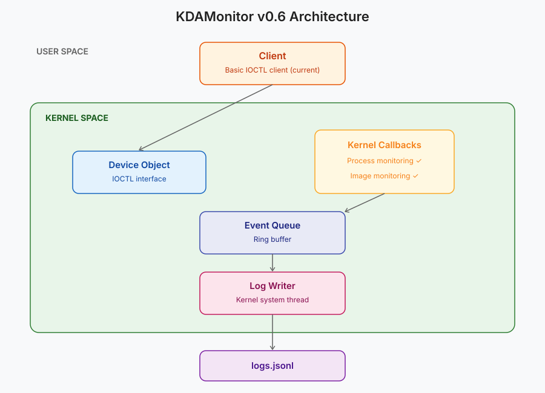

Welcome to the sixth article in the series on building KDAMonitor!

In this article, I'll cover version v0.6 of the project. In this version, I implement the project's second sensor: the image load sensor.

Here are the files involved in this article, and the section that covers each one:

| File | Role | Section |
| --- | --- | --- |
| `event_types.h` | New `KDAMON_IMAGE_LOAD_EVENT_DATA` type + union in `KDAMON_EVENT` | [What to capture when an image is loaded?](#what-to-capture-when-an-image-is-loaded) |
| `image_callback.h` | Register/unregister declarations | [Implementing the callback](#implementing-the-callback) |
| `image_callback.c` | The callback itself | [Implementing the callback](#implementing-the-callback) |
| `log_writer.c` | JSONL serialization specific to image load events | [Serializing image load events to JSONL](#serializing-image-load-events-to-jsonl) |
| `driver_entry.c` | Registering/unregistering the callback on load/unload | [Wiring it into `driver_entry.c`](#wiring-it-into-driver_entryc) |

> The project can be found in this repository: [KDAMonitor](https://github.com/HalfTimeOfLife/KDAMonitor).

---

## What to capture when an image is loaded?

When an image is loaded, the callback can retrieve a fair amount of information. I chose to keep the following, which felt like the most useful:

- the ID of the process the image is mapped into (`ProcessId`)
- the base address and size of the mapping (`ImageBase`, `ImageSize`)
- the raw image properties (`Properties`)
- three flags extracted from those properties: `SystemModeImage`, `ImageMappedToAllPids`, `ImagePartialMap`
- the image's signature level and type (`SignatureLevel`, `SignatureType`)
- the image's full path (`ImageFileName`)

Which gives the following structure in `event_types.h`:

```c
typedef struct _KDAMON_IMAGE_LOAD_EVENT_DATA
{
    HANDLE ProcessId;

    PVOID ImageBase;
    SIZE_T ImageSize;

    ULONG Properties;

    ULONG SystemModeImage;
    ULONG ImageMappedToAllPids;
    ULONG ImagePartialMap;

    ULONG SignatureLevel;
    ULONG SignatureType;

    WCHAR ImageFileName[260];
} KDAMON_IMAGE_LOAD_EVENT_DATA;
```

> The magic number `260` corresponds to the maximum path length on Windows and will be turned into a macro in a later version :)

---

## Implementing the callback

This part covers the driver-side implementation of the callback, all of it in `image_callback.c`. Just like the process sensor, there are three functions, two of which are exposed in the header. These two are strictly identical to the ones described in the previous article, apart from their names:

- `NTSTATUS KdaMonImageCallbackRegister(VOID);`: the function used in `driver_entry.c` to register the callback

- `VOID KdaMonImageCallbackUnregister(VOID);`: the function used in `driver_entry.c` to unregister the callback

And the private function called on every image load:

```c
static VOID KdaMonImageNotifyRoutine(
	_In_opt_ PUNICODE_STRING FullImageName, 
	_In_ HANDLE ProcessId, 
	_In_ PIMAGE_INFO ImageInfo
);
```

This function's signature follows this shape:

```c
PLOAD_IMAGE_NOTIFY_ROUTINE LoadImageNotifyRoutine;

VOID LoadImageNotifyRoutine(
  [in, optional] PUNICODE_STRING FullImageName,
  [in]           HANDLE ProcessId,
  [in]           PIMAGE_INFO ImageInfo
)
{...}
```

> See the Microsoft documentation for [PLOAD_IMAGE_NOTIFY_ROUTINE](https://learn.microsoft.com/en-us/windows-hardware/drivers/ddi/ntddk/nc-ntddk-pload_image_notify_routine), the routine used by [PsSetLoadImageNotifyRoutine](https://learn.microsoft.com/en-us/windows-hardware/drivers/ddi/ntddk/nf-ntddk-pssetloadimagenotifyroutine).

### The notification routine

Let's start by defining the routine called on every image load. As shown above, this routine's signature gives us three pieces of information:

- `PUNICODE_STRING FullImageName`: A pointer to the (Unicode) string containing the image's name
- `HANDLE ProcessId`: The ID of the process the image is mapped into
- `PIMAGE_INFO ImageInfo`: A pointer to the `IMAGE_INFO` structure, which gives information about the image

> Here's the documentation for `IMAGE_INFO`: [IMAGE_INFO structure (filter.h)](https://learn.microsoft.com/en-us/windows/win32/api/filter/ns-filter-image_info).

We start by creating the event:

```c
KDAMON_EVENT Event = { 0 };
Event.Type = KdaMonEventImageLoad;
KeQuerySystemTimePrecise(&Event.Timestamp);

// ProcessId is already given in the function's signature!
Event.Data.ImageLoad.ProcessId = ProcessId;
```

Unlike `FullImageName`, `ImageInfo` isn't documented as optional (annotated `_In_`, not `_In_opt_`). We still keep a check before using it, as a precaution:

```c
if (ImageInfo) {
	Event.Data.ImageLoad.ImageBase = ImageInfo->ImageBase;
	Event.Data.ImageLoad.ImageSize = ImageInfo->ImageSize;
	Event.Data.ImageLoad.Properties = ImageInfo->Properties;
	Event.Data.ImageLoad.SystemModeImage = ImageInfo->SystemModeImage;
	Event.Data.ImageLoad.ImageMappedToAllPids = ImageInfo->ImageMappedToAllPids;
	Event.Data.ImageLoad.ImagePartialMap = ImageInfo->ImagePartialMap;
	Event.Data.ImageLoad.SignatureLevel = ImageInfo->ImageSignatureLevel;
	Event.Data.ImageLoad.SignatureType = ImageInfo->ImageSignatureType;
}
```

`FullImageName`, on the other hand, is explicitly documented as optional: it needs to be checked before use, in case it's `NULL` or points to an empty buffer. The copy follows the same safe-truncation approach as `ImageFileName` in article 05. Finally, we push the event onto the queue:

```c
if (FullImageName && FullImageName->Buffer != NULL) {
	SIZE_T MaxCopyLength = sizeof(Event.Data.ImageLoad.ImageFileName) - sizeof(WCHAR);
	SIZE_T ImageFileNameLength = (FullImageName->Length < MaxCopyLength) ? FullImageName->Length : MaxCopyLength;
	RtlCopyMemory(Event.Data.ImageLoad.ImageFileName, FullImageName->Buffer, ImageFileNameLength);
	Event.Data.ImageLoad.ImageFileName[ImageFileNameLength / sizeof(WCHAR)] = L'\0';
}
else {
	Event.Data.ImageLoad.ImageFileName[0] = L'\0';
}

KdaMonEventQueuePush(&Event);
```

Here's the complete code for `KdaMonImageNotifyRoutine`:

```c
static VOID KdaMonImageNotifyRoutine(
	_In_opt_ PUNICODE_STRING FullImageName, 
	_In_ HANDLE ProcessId, 
	_In_ PIMAGE_INFO ImageInfo
)
{
	KDAMON_EVENT Event = { 0 };
	Event.Type = KdaMonEventImageLoad;
	KeQuerySystemTimePrecise(&Event.Timestamp);

	Event.Data.ImageLoad.ProcessId = ProcessId;

	if (ImageInfo) {
		Event.Data.ImageLoad.ImageBase = ImageInfo->ImageBase;
		Event.Data.ImageLoad.ImageSize = ImageInfo->ImageSize;
		Event.Data.ImageLoad.Properties = ImageInfo->Properties;
		Event.Data.ImageLoad.SystemModeImage = ImageInfo->SystemModeImage;
		Event.Data.ImageLoad.ImageMappedToAllPids = ImageInfo->ImageMappedToAllPids;
		Event.Data.ImageLoad.ImagePartialMap = ImageInfo->ImagePartialMap;
		Event.Data.ImageLoad.SignatureLevel = ImageInfo->ImageSignatureLevel;
		Event.Data.ImageLoad.SignatureType = ImageInfo->ImageSignatureType;
	}

	if (FullImageName && FullImageName->Buffer != NULL) {
		SIZE_T MaxCopyLength = sizeof(Event.Data.ImageLoad.ImageFileName) - sizeof(WCHAR);
		SIZE_T ImageFileNameLength = (FullImageName->Length < MaxCopyLength) ? FullImageName->Length : MaxCopyLength;
		RtlCopyMemory(Event.Data.ImageLoad.ImageFileName, FullImageName->Buffer, ImageFileNameLength);
		Event.Data.ImageLoad.ImageFileName[ImageFileNameLength / sizeof(WCHAR)] = L'\0';
	}
	else {
		Event.Data.ImageLoad.ImageFileName[0] = L'\0';
	}

	KdaMonEventQueuePush(&Event);
}
```

### Registering and unregistering the callback

For this callback, we use `PsSetLoadImageNotifyRoutine` to register it, and `PsRemoveLoadImageNotifyRoutine` to unregister it:

```c
NTSTATUS KdaMonImageCallbackRegister(VOID)
{
	NTSTATUS status = PsSetLoadImageNotifyRoutine(KdaMonImageNotifyRoutine);
	if (!NT_SUCCESS(status))
	{
		KdPrint((DRIVER_TAG "[ERROR] PsSetLoadImageNotifyRoutine failed: 0x%08X\n", status));
	}
	return status;
}

VOID KdaMonImageCallbackUnregister(VOID)
{
	NTSTATUS status = PsRemoveLoadImageNotifyRoutine(KdaMonImageNotifyRoutine);
	if (!NT_SUCCESS(status))
	{
		KdPrint((DRIVER_TAG "[ERROR] PsRemoveLoadImageNotifyRoutine failed: 0x%08X\n", status));
	}
}
```

---

## Serializing image load events to JSONL

Here's the function dedicated to serializing image load events:

```c
static NTSTATUS KdaMonLogWriterWriteImageEvent(_In_ const KDAMON_EVENT* Event, _Out_writes_z_(BufferSize) PSTR EventBuffer, _In_ SIZE_T BufferSize)
{
    CHAR EscapedImage[520];
    if (!KdaMonJsonEscapeW(Event->Data.ImageLoad.ImageFileName, EscapedImage, sizeof(EscapedImage)))
    {
        KdPrint((DRIVER_TAG " [WARNING]: Image path truncated during JSON escape (event %lu)\n", Event->Id));
	}
	return RtlStringCbPrintfA(
		EventBuffer,
		BufferSize,
		"{\"id\":%lu,\"type\":\"%s\",\"timestamp\":%lld,"
		"\"pid\":%lu,\"image_base\":\"%p\",\"image_size\":%llu,"
		"\"system_mode_image\":%s,\"image_mapped_to_all_pids\":%s,"
		"\"image_partial_map\":%s,\"signature_level\":%u,\"signature_type\":%u,"
		"\"image\":\"%s\"}\n",
		Event->Id,
		KdaMonEventTypeToString(Event->Type),
		Event->Timestamp.QuadPart,
		(ULONG)(ULONG_PTR)Event->Data.ImageLoad.ProcessId,
		Event->Data.ImageLoad.ImageBase,
		(unsigned long long)Event->Data.ImageLoad.ImageSize,
		Event->Data.ImageLoad.SystemModeImage ? "true" : "false",
		Event->Data.ImageLoad.ImageMappedToAllPids ? "true" : "false",
		Event->Data.ImageLoad.ImagePartialMap ? "true" : "false",
		Event->Data.ImageLoad.SignatureLevel,
		Event->Data.ImageLoad.SignatureType,
		EscapedImage
	);
}
```

Here's, briefly, what the function does:

1. It escapes the special characters in the image path using the `KdaMonJsonEscapeW` function.

> This function won't be detailed here for the sake of simplicity. It can still be checked out in [log_writer.c](https://github.com/HalfTimeOfLife/KDAMonitor/blob/main/driver/src/log_writer.c).

2. It fills the `EventBuffer` buffer with the information gathered from the event, in JSON format.

An image load event line will look like this:

```json
{"id":137,"type":"image_load","timestamp":134025123456789012,"pid":1234,"image_base":"0x00007FFA12340000","image_size":45056,"system_mode_image":false,"image_mapped_to_all_pids":false,"image_partial_map":false,"signature_level":8,"signature_type":1,"image":"C:\\PATH\\TO\\DLL.dll"}
```

---

## Wiring it into `driver_entry.c`

We start by adding the unregister call in `DriverUnload`:

```c
void DriverUnload(_In_ PDRIVER_OBJECT DriverObject)
{
	UNREFERENCED_PARAMETER(DriverObject);

	KdaMonImageCallbackUnregister(); // Unregistering the callback
	KdaMonProcessCallbackUnregister();
	KdaMonLogWriterStop();
	KdaMonEventQueueDestroy();
	KdaMonDeleteDevice(g_DeviceObject);
	KdPrint((DRIVER_TAG " [SUCCESS]: Driver Unload called\n"));
}
```

For now, the image load callback is the last one to be registered, so it's the first one to be unregistered.

In `DriverEntry`, we add the registration at the end of the function, right after the process callback's registration:

```c
NTSTATUS DriverEntry(_In_ PDRIVER_OBJECT DriverObject, _In_ PUNICODE_STRING RegistryPath)
{
	UNREFERENCED_PARAMETER(RegistryPath);

	...
	// --- Register process creation callback ---
	if (!NT_SUCCESS(KdaMonProcessCallbackRegister()))
	{
		KdPrint((DRIVER_TAG " [ERROR]: KdaMonProcessCallbackRegister failed\n"));
		return STATUS_UNSUCCESSFUL;
	}

	// --- Register image load callback ---
	if (!NT_SUCCESS(KdaMonImageCallbackRegister()))
	{
		KdPrint((DRIVER_TAG " [ERROR]: KdaMonImageCallbackRegister failed\n"));
		return STATUS_UNSUCCESSFUL;
	}

	KdPrint((DRIVER_TAG " [SUCCESS]: Initialized successfully\n"));
	return STATUS_SUCCESS;
}
```

For this version, the validation test is to check that the sensor properly captures the image loads of a regular process (its dependency DLLs), as well as a single, easily identifiable DLL load. For this, I wrote the following script (`test_v06.ps1`):

```powershell
# test_v06.ps1

$Driver = "KDAMonitor"
$DriverPath = "$env:USERPROFILE\Desktop\$Driver.sys"

sc.exe stop $Driver
sc.exe delete $Driver

sc.exe create $Driver type= kernel binPath= $DriverPath
sc.exe start $Driver

Start-Process notepad.exe -Wait

rundll32.exe user32.dll,MessageBeep

sc.exe stop $Driver
sc.exe delete $Driver
```

Here's a demo of this test in action:

<video controls width="100%">
  <source src="demo-image-sensor.en.mp4" type="video/mp4">
</video>

---

## Conclusion

A second sensor down! Not much new in this article, it's pretty close to the previous one, but the next one will be quite different :).



Thanks for reading all the way through, see you for the next, seventh article in this series: **Getting Ready for Network Monitoring: Setting Up a WFP Session**.