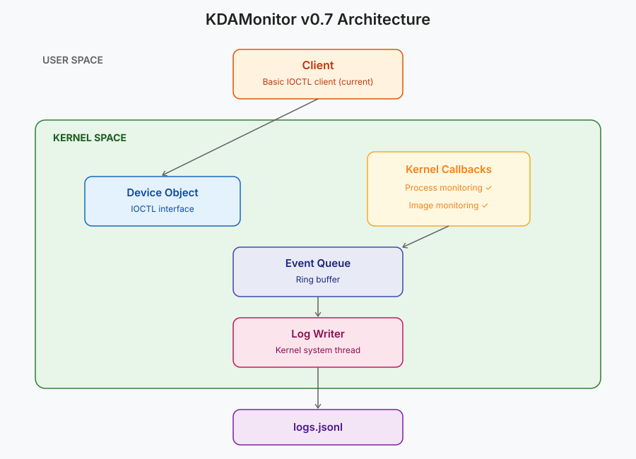

---
title: "07 - Preparing Network Monitoring: Setting Up the WFP Session"
date: 2026-09-21
draft: false
description: "Setting up KDAMonitor's WFP session (provider, sublayer)."
summary: "Setting up KDAMonitor's WFP session (provider, sublayer)."
series: ["KDAMonitor"]
series_order: 7
tags:
  - KDAMonitor
  - Windows Kernel
  - Kernel Driver
  - C
---

Welcome to the seventh article in the series on developing KDAMonitor!

In this article, I'll cover version v0.7 of the project. This version doesn't filter any network traffic yet, it sets up the WFP infrastructure (provider, sublayer) that the network sensor from v0.8 will hook into. One section of this article will cover the second crash I ran into.

Here are the files involved in this article, and the section that explains each one:

| File | Role | Section |
| --- | --- | --- |
| `wfp_session.h` | Provider/sublayer GUIDs, declarations | [Implementing the WFP session](#implementing-the-wfp-session) |
| `wfp_session.c` | Opening the engine, adding provider/sublayer, cleanup | [Implementing the WFP session](#implementing-the-wfp-session) |
| `driver_entry.c` | Integration into DriverEntry/DriverUnload | [Integration into `driver_entry.c`](#integration-into-driver_entryc) |
| `device.c` / `driver_entry.c` | Crash #2 (`PAGE_FAULT_IN_NONPAGED_AREA`) and its fix | [Crash #2: the device object deleted twice](#crash-2-the-device-object-deleted-twice) |

> The project can be found in this repository: [KDAMonitor](https://github.com/HalfTimeOfLife/KDAMonitor).

---

## WFP in brief

As stated in Microsoft's documentation, the [Windows Filtering Platform](https://learn.microsoft.com/en-us/windows/win32/fwp/windows-filtering-platform-start-page) is a set of APIs and services for filtering network traffic.

To open a filtering session, we use `FwpmEngineOpen`, which establishes the connection with the WFP engine. Once the session is open, we can declare a *provider* with `FwpmProviderAdd`. A provider is the identity of the application (or driver) with the WFP engine. It allows, for example, direct interaction with objects, such as *sublayers*, registered by KDAMonitor.

*Sublayers* are reserved spaces used to store KDAMonitor's filters and the network callout (planned for v0.8). For this version, we simply open the session and register the provider and the sublayer. So for now, no callout or filter.

---

## Implementing the WFP session

Before getting into the actual code, we first need to define GUIDs, their names and descriptions, we need two of them:

- for the provider:

```c
DEFINE_GUID(KDAMON_WFP_PROVIDER_GUID,
    0x16821234, 0xd300, 0x42f1,
    0xbc, 0xe8, 0xd2, 0x23, 0x1a, 0xf3, 0x25, 0xc3);
#define KDAMON_WFP_PROVIDER_NAME    L"KDAMonitor Provider"
#define KDAMON_WFP_PROVIDER_DESCRIPTION L"KDAMonitor - Kernel Driver Activity Monitor"

```

- and for the sublayer:

```c
DEFINE_GUID(KDAMON_WFP_SUBLAYER_GUID,
    0xa141444c, 0x7f15, 0x4a05,
    0xa2, 0x95, 0x07, 0xca, 0x38, 0xc2, 0x3c, 0xb1);
#define KDAMON_WFP_SUBLAYER_NAME    L"KDAMonitor Sublayer"
#define KDAMON_WFP_SUBLAYER_DESCRIPTION L"KDAMonitor sublayer for network event monitoring"
```

> To use the `DEFINE_GUID` macro, the file must start with `INITGUID`.

We also define a *handle* for the engine (`HANDLE g_EngineHandle`), representing the connection to the WFP engine. The `NTSTATUS KdaMonWfpSessionInit(void)` function is responsible for opening the connection to the WFP engine, then registering KDAMonitor's provider and sublayer. We start by declaring the structures used by all three steps before opening the session with `FwpmEngineOpen`:

```c
NTSTATUS status;
FWPM_SESSION wfpSession = { 0 };
FWPM_PROVIDER provider = { 0 };
FWPM_SUBLAYER subLayer = { 0 };

status = FwpmEngineOpen(NULL, RPC_C_AUTHN_WINNT, NULL, &wfpSession, &g_EngineHandle);
if (status != STATUS_SUCCESS)
{
	KdPrint((DRIVER_TAG " [ERROR]: FwpmEngineOpen failed with status 0x%X\n", status));
	return STATUS_UNSUCCESSFUL;
}
```

We then register the *provider* with `FwpmProviderAdd`:

```c
provider.providerKey = KDAMON_WFP_PROVIDER_GUID;
provider.displayData.name = KDAMON_WFP_PROVIDER_NAME;
provider.displayData.description = KDAMON_WFP_PROVIDER_DESCRIPTION;
provider.flags = 0;
provider.serviceName = NULL;
status = FwpmProviderAdd(g_EngineHandle, &provider, NULL);
if (status != STATUS_SUCCESS)
{
	KdPrint((DRIVER_TAG " [ERROR]: FwpmProviderAdd failed with status 0x%X\n", status));
	FwpmEngineClose(g_EngineHandle);
	g_EngineHandle = NULL;
	return STATUS_UNSUCCESSFUL;
}
```

`providerKey` and `displayData` (name + description) identify the provider with the WFP engine, and in tools such as `netsh wfp show providers`. `serviceName` stays `NULL` since the provider isn't tied to a specific Windows service.

And finally the *sublayer*, with `FwpmSubLayerAdd`:

```c
subLayer.subLayerKey = KDAMON_WFP_SUBLAYER_GUID;
GUID providerKey = KDAMON_WFP_PROVIDER_GUID;
subLayer.providerKey = &providerKey;
subLayer.displayData.name = KDAMON_WFP_SUBLAYER_NAME;
subLayer.displayData.description = KDAMON_WFP_SUBLAYER_DESCRIPTION;
subLayer.flags = 0;
subLayer.weight = (UINT16)0;
status = FwpmSubLayerAdd(g_EngineHandle, &subLayer, NULL);
if (status != STATUS_SUCCESS)
{
	KdPrint((DRIVER_TAG " [ERROR]: FwpmSubLayerAdd failed with status 0x%X\n", status));
	FwpmProviderDeleteByKey(g_EngineHandle, &KDAMON_WFP_PROVIDER_GUID);
	FwpmEngineClose(g_EngineHandle);
	g_EngineHandle = NULL;
	return STATUS_UNSUCCESSFUL;
}

return STATUS_SUCCESS;
```

`subLayer.providerKey` links the sublayer to the provider created just above. `weight` sets the relative priority between sublayers, a parameter that doesn't matter as long as only one sublayer exists.

At each step, a failure undoes what the previous step built, in reverse order: if `FwpmProviderAdd` fails, we simply close the session with `FwpmEngineClose`; if `FwpmSubLayerAdd` fails, we go one step further by first deleting the freshly created provider (`FwpmProviderDeleteByKey`) before closing the session.

To clean up/remove the WFP session, we call `VOID KdaMonWfpSessionCleanup(void)`, which is the counterpart of `KdaMonWfpSessionInit` and therefore deletes the *sublayer* (`FwpmSubLayerDeleteByKey`), deletes the *provider* (`FwpmProviderDeleteByKey`), closes the WFP engine (`FwpmEngineClose`), and resets the engine's *handle* to `NULL` (`g_EngineHandle`):

```c
VOID KdaMonWfpSessionCleanup(void)
{
	NTSTATUS status;
	if (g_EngineHandle == NULL)
		return;

	status = FwpmSubLayerDeleteByKey(g_EngineHandle, &KDAMON_WFP_SUBLAYER_GUID);
	if (status != STATUS_SUCCESS)
	{
		KdPrint((DRIVER_TAG " [ERROR]: FwpmSubLayerDeleteByKey failed with status 0x%X\n", status));
	}

	status = FwpmProviderDeleteByKey(g_EngineHandle, &KDAMON_WFP_PROVIDER_GUID);
	if (status != STATUS_SUCCESS)
	{
		KdPrint((DRIVER_TAG " [ERROR]: FwpmProviderDeleteByKey failed with status 0x%X\n", status));
	}

	status = FwpmEngineClose(g_EngineHandle);
	if (status != STATUS_SUCCESS)
	{
		KdPrint((DRIVER_TAG " [ERROR]: FwpmEngineClose failed with status 0x%X\n", status));
	}

	g_EngineHandle = NULL;

	KdPrint((DRIVER_TAG " [SUCCESS]: WFP session closed successfully\n"));
}
```

---

## Integration into `driver_entry.c`

In the code, the WFP session is initialized between the *device* and the queue: since the WFP session isn't a sensor, it's placed near the beginning.

The initialization order in `DriverEntry` is therefore:

- the *device*
- the WFP session
- the queue
- the *log writer*
- and the callbacks (process and image)

We add this to the function:

```c
	// --- Initialize WFP session ---
	status = KdaMonWfpSessionInit();
	if (!NT_SUCCESS(status))
	{
		KdPrint((DRIVER_TAG " [ERROR]: KdaMonWfpSessionInit failed\n"));
		goto cleanup_device;
	}
```

Tearing these elements down in `DriverUnload` happens in reverse order. Here are both complete functions:

```c
void DriverUnload(_In_ PDRIVER_OBJECT DriverObject)
{
	UNREFERENCED_PARAMETER(DriverObject);

	KdPrint((DRIVER_TAG " [INFO]: Driver Unload begin\n"));

	// --- Unregister callbacks ---
	KdaMonImageCallbackUnregister();
	KdaMonProcessCallbackUnregister();

	// --- Stop the log writer ---
	KdaMonLogWriterStop();

	// --- Destroy the event queue ---
	KdaMonEventQueueDestroy();

	// --- Cleanup WFP session ---
	KdaMonWfpSessionCleanup();
	
	// --- Delete device object ---
	KdaMonDeleteDevice(&g_DeviceObject);
	KdPrint((DRIVER_TAG " [INFO]: Driver Unload complete\n"));
}

NTSTATUS DriverEntry(_In_ PDRIVER_OBJECT DriverObject, _In_ PUNICODE_STRING RegistryPath)
{
	UNREFERENCED_PARAMETER(RegistryPath);

	KdPrint((DRIVER_TAG " [INFO]: DriverEntry begin\n"));
	NTSTATUS status;

	DriverObject->DriverUnload = DriverUnload;
	DriverObject->MajorFunction[IRP_MJ_CREATE] = KdaMonCreateClose;
	DriverObject->MajorFunction[IRP_MJ_CLOSE] = KdaMonCreateClose;
	DriverObject->MajorFunction[IRP_MJ_DEVICE_CONTROL] = KdaMonDeviceControl;

	// --- Create device object ---
	status = KdaMonCreateDevice(DriverObject, &g_DeviceObject);
	if (!NT_SUCCESS(status))
	{
		goto cleanup_none;
	}

	// --- Initialize WFP session ---
	status = KdaMonWfpSessionInit();
	if (!NT_SUCCESS(status))
	{
		KdPrint((DRIVER_TAG " [ERROR]: KdaMonWfpSessionInit failed\n"));
		goto cleanup_device;
	}
	
	// --- Initialize the event queue ---
	if (!KdaMonEventQueueInitialize())
	{
		KdPrint((DRIVER_TAG " [ERROR]: EventQueueInitialize failed\n"));
		status = STATUS_UNSUCCESSFUL;
		goto cleanup_wfp;
	}

	// --- Start the log writer thread ---
	if (!KdaMonLogWriterStart(DriverObject))
	{
		KdPrint((DRIVER_TAG " [ERROR]: KdaMonLogWriterStart failed\n"));
		status = STATUS_UNSUCCESSFUL;
		goto cleanup_queue;
	}

	// --- Register process creation callback ---
	status = KdaMonProcessCallbackRegister();
	if (!NT_SUCCESS(status))
	{
		KdPrint((DRIVER_TAG " [ERROR]: KdaMonProcessCallbackRegister failed\n"));
		goto cleanup_logwriter;
	}

	// --- Register image load callback ---
	status = KdaMonImageCallbackRegister();
	if (!NT_SUCCESS(status))
	{
		KdPrint((DRIVER_TAG " [ERROR]: KdaMonImageCallbackRegister failed\n"));
		goto cleanup_process;
	}

	KdPrint((DRIVER_TAG " [SUCCESS]: Initialized successfully\n"));
	return STATUS_SUCCESS;

cleanup_process:
	KdaMonProcessCallbackUnregister();
cleanup_logwriter:
	KdaMonLogWriterStop();
cleanup_queue:
	KdaMonEventQueueDestroy();
cleanup_wfp:
	KdaMonWfpSessionCleanup();
cleanup_device:
	KdaMonDeleteDevice(&g_DeviceObject);
cleanup_none:
	return status;
}
```

> The cleanup structure for objects on initialization failure in `DriverEntry` from the previous version was changed to use goto, which makes the code much cleaner.

---

## Crash #2: the device object deleted twice

### Context

This crash showed up while testing the `DriverEntry` refactor presented above. The *dump* is kept in the repo, in `docs/dumps/2_PAGE_FAULT_IN_NONPAGED_AREA.dmp`.

The bugcheck recorded is `PAGE_FAULT_IN_NONPAGED_AREA (0x50)`, with a read access (`Arg2 = 0`) to an invalid address. The faulting instruction is in `nt!ObQueryNameStringMode`, called from `nt!IoDeleteDevice`, itself called from `KdaMonDeleteDevice` (`device.c`) inside `DriverUnload` (`driver_entry.c`):

```text
nt!ObQueryNameStringMode+a8
fffff802`7a369ad8 488b81a0000000  mov     rax,qword ptr [rcx+0A0h]
```

`IoDeleteDevice` internally calls `ObQueryNameString` to resolve the object's name before removing it — here, on a `DEVICE_OBJECT` that had already been freed.

### Diagnosis

The faulty code was in `DriverEntry`, which was missing a `return STATUS_SUCCESS;` right after the success log:

```c
	KdPrint((DRIVER_TAG " [SUCCESS]: Initialized successfully\n"));
	// missing: return STATUS_SUCCESS;
cleanup_process:
	KdaMonProcessCallbackUnregister();
cleanup_wfp:
	KdaMonWfpSessionCleanup();
cleanup_logwriter:
	KdaMonLogWriterStop();
cleanup_queue:
	KdaMonEventQueueDestroy();
cleanup_device:
	KdaMonDeleteDevice(g_DeviceObject);
cleanup_none:
	return status; // the driver reaches this point even without an error!
```

Without this `return`, execution fell straight through into the cleanup cascade even after a successful initialization, before returning `STATUS_SUCCESS`.

`KdaMonDeleteDevice` received `g_DeviceObject` **by value**. It could therefore free the `DEVICE_OBJECT`, but couldn't set `g_DeviceObject` back to `NULL`.

So after the first call, `g_DeviceObject` still held the address of the now-freed object (a *dangling pointer*).

At unload time, `DriverUnload` called `KdaMonDeleteDevice(g_DeviceObject)` again, which then tried to use this invalid pointer, causing the crash.

### Fix

The fix works on two levels:

- the missing `return status;`, added right after the success log
- and `KdaMonDeleteDevice`, which now takes a `PDEVICE_OBJECT*` and resets the caller's pointer to `NULL` after deletion, as a safeguard against any future double-cleanup:

```c
void KdaMonDeleteDevice(_Inout_ PDEVICE_OBJECT* DeviceObject)
{
	UNICODE_STRING symLink = RTL_CONSTANT_STRING(KDAMON_SYMLINK_NAME);
	IoDeleteSymbolicLink(&symLink);

	if (*DeviceObject != NULL)
	{
		IoDeleteDevice(*DeviceObject);
		*DeviceObject = NULL;
	}
	...
}
```

Callers now pass `&g_DeviceObject` instead of `g_DeviceObject`.

---

## Validation

For this version, validation consists of checking that KDAMonitor's provider and sublayer do appear in the WFP engine's state after the driver loads, and disappear after it unloads. To do this, I used `netsh wfp show state` before, during, and after the driver's lifecycle, using the following script (`test_v07.ps1`):

```powershell
# test_v07.ps1

$Driver = "KDAMonitor"
$DriverPath = "$env:USERPROFILE\Desktop\$Driver.sys"

netsh wfp show state file=wfpstate_before.xml

sc.exe stop $Driver
sc.exe delete $Driver

sc.exe create $Driver type= kernel binPath= $DriverPath
sc.exe start $Driver

netsh wfp show state file=wfpstate_after_load.xml

sc.exe stop $Driver

netsh wfp show state file=wfpstate_after_unload.xml

sc.exe delete $Driver
```

Before loading, no `KDAMonitor` entry:


After loading, the provider and sublayer do appear in the WFP engine's state:


And after unloading, no trace of either one remains:


---

## Conclusion

In this version, the WFP session was opened, and KDAMonitor's provider and sublayer registered, waiting for the first filter.

> Although this version wasn't very exciting (a bit boring, honestly :)), it's a necessary step toward the part I find most interesting: the network sensor.



Thanks for reading all the way through, and see you soon for the next, eighth article in this series: **Monitoring Network Connections with the Windows Filtering Platform**.