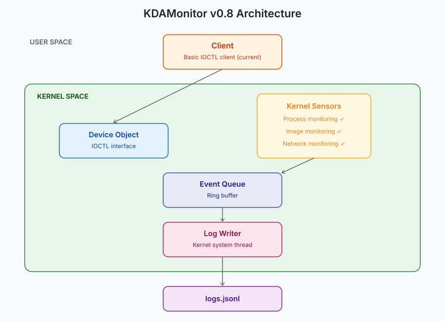

Welcome to the eighth article in the KDAMonitor development series!

In this article, which covers v0.8 of the project, I implement the third sensor of KDAMonitor: the network connection sensor. As a reminder, in the previous article (v0.7), I implemented the WFP session (engine, `provider` and `sublayer`) without adding the observation part.

The sensor will inspect the `IPv4` packets passing through, without blocking them, and extract the relevant data. Unlike the other sensors, there is no routine or *callback* this time: we will use a *callout* that is triggered by a filter added to the `sublayer`.

Here are the files covered by this article, and the section that explains each one:

| File | Role | Section |
| --- | --- | --- |
| `event_types.h` | New `KDAMON_NETWORK_EVENT_DATA` type, `KDAMON_NETWORK_DIRECTION` enum + union in `KDAMON_EVENT` | [What to capture from a network connection?](#what-to-capture-from-a-network-connection) |
| `guids.c` | Centralized `DEFINE_GUID` declarations (session + callouts) | [Centralizing the GUIDs](#centralizing-the-guids) |
| `wfp_callout.h` | Register/unregister declarations | [Implementing the callout](#implementing-the-callout) |
| `wfp_callout.c` | The callouts, their filters, the registration | [Implementing the callout](#implementing-the-callout) |
| `wfp_session.c` / `wfp_session.h` | Shared engine handle, sublayer weight | [Adapting the WFP session](#adapting-the-wfp-session) |
| `log_writer.c` | JSONL serialization of network events | [Serializing network events to JSONL](#serializing-network-events-to-jsonl) |
| `driver_entry.c` | Callout registration/unregistration | [Integration in `driver_entry.c`](#integration-in-driver_entryc) |

> The project can be found in this repository: [KDAMonitor](https://github.com/HalfTimeOfLife/KDAMonitor).

---

## What to capture from a network connection?

As with every sensor, I first need to decide what information to keep from a network connection. I kept six items:

- the PID of the process that initiated the connection
- the path of that process
- the protocol used
- the local IP address and port
- the remote IP address and port
- the direction: is the connection inbound or outbound?

This gives us the following structures:

```c
typedef enum _KDAMON_NETWORK_DIRECTION {
    KDAMON_NETWORK_DIRECTION_INBOUND,
    KDAMON_NETWORK_DIRECTION_OUTBOUND,
} KDAMON_NETWORK_DIRECTION;

typedef struct _KDAMON_NETWORK_EVENT_DATA {
    ULONG  ProcessId;
    WCHAR ProcessPath[260];

    UINT8  Protocol;

    ULONG  LocalIp;
    USHORT LocalPort;

    ULONG  RemoteIp;
    USHORT RemotePort;

    KDAMON_NETWORK_DIRECTION Direction;
} KDAMON_NETWORK_EVENT_DATA;
```

> For IP addresses and ports, I chose `ULONG` and `USHORT` for simplicity, which limits this version to IPv4.

Of course, it has to be added to the union of the final structure:

```c
typedef struct _KDAMON_EVENT
{
...
    union
    {
        KDAMON_PROCESS_EVENT_DATA Process;
        KDAMON_IMAGE_LOAD_EVENT_DATA ImageLoad;
        KDAMON_NETWORK_EVENT_DATA Network;
    } Data;
} KDAMON_EVENT, * PKDAMON_EVENT;
```

> The magic number `260` is the maximum path length in Windows and will be replaced by a macro in a later version :)

---

## How does a WFP callout work?

So far, all the sensors worked on the same `callback` principle: we gave Windows a function, through a routine, and it ran it when the event occurred. The WFP engine does not call our functions directly. It applies filters to the traffic, and if a packet matches a filter, that filter triggers our **callout**.

In the previous article, we opened the session and registered the provider and the sublayer. What is missing now is the part that actually looks at the traffic.

### The ALE layers

WFP splits network processing into several layers. The ones we care about are the **ALE** layers (*Application Layer Enforcement*, [documentation](https://learn.microsoft.com/en-us/windows/win32/fwp/ale-layers)), which track connections at the application level and provide the process PID and path in the metadata. I use two of them:

| Layer | Direction | Triggered by |
| --- | --- | --- |
| `FWPM_LAYER_ALE_AUTH_CONNECT_V4` | outbound | a TCP `connect()`, the first UDP packet to a given remote address/port pair, the first outbound ICMP message |
| `FWPM_LAYER_ALE_AUTH_RECV_ACCEPT_V4` | inbound | an incoming TCP connection, the first inbound UDP packet from a given address/port pair, the first inbound ICMP message |

This gives us one notification per connection (or per UDP/ICMP flow). For each direction, three objects have to be set up:

1. **The kernel callout**, with [`FwpsCalloutRegister2`](https://learn.microsoft.com/en-us/windows-hardware/drivers/ddi/fwpsk/nf-fwpsk-fwpscalloutregister2). This is where we provide our functions, in an [`FWPS_CALLOUT2`](https://learn.microsoft.com/en-us/windows-hardware/drivers/ddi/fwpsk/ns-fwpsk-fwps_callout2_) structure: [`classifyFn`](https://learn.microsoft.com/en-us/windows-hardware/drivers/ddi/fwpsk/nc-fwpsk-fwps_callout_classify_fn2) (called when traffic matches a filter), `notifyFn` (notifications about filters being added or removed) and `flowDeleteFn` (unused here, left as `NULL`).
2. **Adding the callout**, with [`FwpmCalloutAdd`](https://learn.microsoft.com/en-us/windows-hardware/drivers/ddi/fwpmk/nf-fwpmk-fwpmcalloutadd0), which tells the engine that a callout exists for a given layer.
3. **The filter**, with [`FwpmFilterAdd`](https://learn.microsoft.com/en-us/windows-hardware/drivers/ddi/fwpmk/nf-fwpmk-fwpmfilteradd0), which is placed in our sublayer and points to the callout.

### Observing without blocking

In our case, the filter is not used to filter anything: it is used to trigger the callout on all the IPv4 traffic of the layer, in order to extract information from it. We give it the `FWP_ACTION_CALLOUT_INSPECTION` action, which means the callout observes without deciding, and therefore without blocking. In return, `classifyFn` must return `FWP_ACTION_CONTINUE` so that the traffic carries on its way.

---

## Centralizing the GUIDs

The callout, the filter, the provider and the sublayer are all identified by GUIDs. In v0.7, the two session GUIDs were defined at the top of `wfp_session.c`. With the two callout GUIDs, which are used in `wfp_callout.c`, there are now four of them spread across several files. So I grouped them in a dedicated file, `guids.c`.

`INITGUID` is defined in `guids.c` only, and the other files only see the `extern const GUID` declarations from their headers:

```c
// guids.c
#define INITGUID
#include <guiddef.h>
#include <ntddk.h>

#define NDIS630
#include <ndis.h>

#include <fwpmk.h>

// --- Session GUIDs ---
DEFINE_GUID(KDAMON_WFP_PROVIDER_GUID, ...);
DEFINE_GUID(KDAMON_WFP_SUBLAYER_GUID, ...);

// --- Callout GUIDs ---
DEFINE_GUID(KDAMON_WFP_CALLOUT_OUTBOUND_GUID, ...);
DEFINE_GUID(KDAMON_WFP_CALLOUT_INBOUND_GUID, ...);
```

```c
// wfp_callout.h
extern const GUID KDAMON_WFP_CALLOUT_OUTBOUND_GUID;
extern const GUID KDAMON_WFP_CALLOUT_INBOUND_GUID;
```

This way, `wfp_session.c` no longer needs to define `INITGUID` or its own GUIDs, and if a GUID changes, there is only one place to edit.

---

## Implementing the callout

Everything is in the `wfp_callout.c` file. Two functions are exposed in the header, and everything else is private:

- `NTSTATUS KdaMonWfpCalloutRegister(PDEVICE_OBJECT DeviceObject);`: registers the callouts and their filters
- `VOID KdaMonWfpCalloutUnregister(VOID);`: removes them

The file keeps the identifiers returned by WFP in global variables, which are needed to remove everything later:

```c
static UINT32 g_WpsCalloutIdOutbound = 0;
static UINT32 g_WpsCalloutIdInbound = 0;
static UINT64 g_FilterIdOutbound = 0;
static UINT64 g_FilterIdInbound = 0;
```

### Processing the packets

When a packet matches the filter, WFP calls `classifyFn` with three parameters:

- `inFixedValues`: the fields of the filtered layer (protocol, addresses, ports)
- `inMetaValues`: the metadata (PID, process path)
- `classifyOut`: where we tell the engine what we decide

The fields of `inFixedValues` are accessed through an `FWPS_FIELD_*` index that depends on the layer. The processing is identical for outbound and inbound connections, so there is a common function that receives these indices as parameters:

```c
static VOID KdaMonWfpClassifyCommon(
    _In_    const FWPS_INCOMING_VALUES0* inFixedValues,
    _In_    const FWPS_INCOMING_METADATA_VALUES0* inMetaValues,
    _Inout_ FWPS_CLASSIFY_OUT0* classifyOut,
    _In_    KDAMON_NETWORK_DIRECTION Direction,
    _In_    UINT32 FieldProtocol,
    _In_    UINT32 FieldLocalIp,
    _In_    UINT32 FieldLocalPort,
    _In_    UINT32 FieldRemoteIp,
    _In_    UINT32 FieldRemotePort
)
{
    KDAMON_EVENT Event = { 0 };

    Event.Type = KdaMonEventNetwork;
    KeQuerySystemTimePrecise(&Event.Timestamp);

    // --- PID ---
    Event.Data.Network.ProcessId = (ULONG)inMetaValues->processId;

    // --- Process path ---
    if (inMetaValues->processPath &&
        inMetaValues->processPath->data &&
        inMetaValues->processPath->size > 0)
    {
        SIZE_T bytesToCopy = min(
            inMetaValues->processPath->size,
            (RTL_NUMBER_OF(Event.Data.Network.ProcessPath) - 1) * sizeof(WCHAR)
        );
        RtlCopyMemory(Event.Data.Network.ProcessPath,
            inMetaValues->processPath->data,
            bytesToCopy);
        Event.Data.Network.ProcessPath[bytesToCopy / sizeof(WCHAR)] = L'\0';
    }

    // --- Protocol, IPs, ports ---
    Event.Data.Network.Protocol = (UINT8)inFixedValues->incomingValue[FieldProtocol].value.uint8;
    Event.Data.Network.LocalIp = inFixedValues->incomingValue[FieldLocalIp].value.uint32;
    Event.Data.Network.RemoteIp = inFixedValues->incomingValue[FieldRemoteIp].value.uint32;
    Event.Data.Network.LocalPort = inFixedValues->incomingValue[FieldLocalPort].value.uint16;
    Event.Data.Network.RemotePort = inFixedValues->incomingValue[FieldRemotePort].value.uint16;

    Event.Data.Network.Direction = Direction;

    KdaMonEventQueuePush(&Event);

    classifyOut->actionType = FWP_ACTION_CONTINUE;
}
```

Here is a summary of what the function does:

1. We create the event, as for the other sensors.
2. The PID comes from the metadata; WFP provides it as a 64-bit value, and we narrow it to a `ULONG`.
3. The process path is provided as a blob (`FWP_BYTE_BLOB`) whose size is in bytes.
4. The protocol, addresses and ports are read from `inFixedValues` and added to the event.
5. We push the event to the queue and return `FWP_ACTION_CONTINUE`.

> The path is kept in NT format (`\Device\HarddiskVolume3\...`) rather than Win32 format (`C:\...`).

### The two `classifyFn` functions

What WFP actually calls are two functions, one for each direction. They simply indicate the direction and the field indices of their layer:

```c
static VOID KdaMonWfpClassifyFnOutbound(
    _In_        const FWPS_INCOMING_VALUES0* inFixedValues,
    _In_        const FWPS_INCOMING_METADATA_VALUES0* inMetaValues,
    _Inout_opt_ VOID* layerData,
    _In_opt_    const VOID* classifyContext,
    _In_        const FWPS_FILTER2* filter,
    _In_        UINT64 flowContext,
    _Inout_     FWPS_CLASSIFY_OUT0* classifyOut
)
{
    UNREFERENCED_PARAMETER(layerData);
    UNREFERENCED_PARAMETER(classifyContext);
    UNREFERENCED_PARAMETER(filter);
    UNREFERENCED_PARAMETER(flowContext);

    KdaMonWfpClassifyCommon(
        inFixedValues, inMetaValues, classifyOut,
        KDAMON_NETWORK_DIRECTION_OUTBOUND,
        FWPS_FIELD_ALE_AUTH_CONNECT_V4_IP_PROTOCOL,
        FWPS_FIELD_ALE_AUTH_CONNECT_V4_IP_LOCAL_ADDRESS,
        FWPS_FIELD_ALE_AUTH_CONNECT_V4_IP_LOCAL_PORT,
        FWPS_FIELD_ALE_AUTH_CONNECT_V4_IP_REMOTE_ADDRESS,
        FWPS_FIELD_ALE_AUTH_CONNECT_V4_IP_REMOTE_PORT
    );
}
```

The inbound version, `KdaMonWfpClassifyFnInbound`, is identical: it passes `KDAMON_NETWORK_DIRECTION_INBOUND` and the `FWPS_FIELD_ALE_AUTH_RECV_ACCEPT_V4_*` indices. A `notifyFn` is also required at registration, but we do not use it. So `KdaMonWfpNotifyFn` is a simple stub that returns `STATUS_SUCCESS`.

### Registering the callouts

For each direction, `KdaMonWfpCalloutRegister` performs the three steps seen above. For the outbound connection, we have:

```c
NTSTATUS KdaMonWfpCalloutRegister(_In_ PDEVICE_OBJECT DeviceObject)
{
    NTSTATUS      status;
    FWPS_CALLOUT2 callout_s = { 0 };
    FWPM_CALLOUT  callout_m = { 0 };
    FWPM_FILTER   filter = { 0 };

    // =========================================================
    // OUTBOUND — FWPM_LAYER_ALE_AUTH_CONNECT_V4
    // =========================================================

    RtlCopyMemory(&callout_s.calloutKey, &KDAMON_WFP_CALLOUT_OUTBOUND_GUID, sizeof(GUID));
    callout_s.flags = 0;
    callout_s.classifyFn = KdaMonWfpClassifyFnOutbound;
    callout_s.notifyFn = KdaMonWfpNotifyFn;
    callout_s.flowDeleteFn = NULL;

    status = FwpsCalloutRegister2(DeviceObject, &callout_s, &g_WpsCalloutIdOutbound);
    if (!NT_SUCCESS(status))
    {
        KdPrint((DRIVER_TAG " [ERROR]: FwpsCalloutRegister2 (outbound) failed: 0x%X\n", status));
        return status;
    }
```

First, we register the kernel-side callout with its functions.

```c
    RtlCopyMemory(&callout_m.calloutKey, &KDAMON_WFP_CALLOUT_OUTBOUND_GUID, sizeof(GUID));
    RtlCopyMemory(&callout_m.applicableLayer, &FWPM_LAYER_ALE_AUTH_CONNECT_V4, sizeof(GUID));
    callout_m.displayData.name = KDAMON_WFP_CALLOUT_OUTBOUND_NAME;
    callout_m.displayData.description = KDAMON_WFP_CALLOUT_OUTBOUND_DESCRIPTION;
    callout_m.flags = 0;

    status = FwpmCalloutAdd(g_EngineHandle, &callout_m, NULL, NULL);
    if (!NT_SUCCESS(status))
    {
        KdPrint((DRIVER_TAG " [ERROR]: FwpmCalloutAdd (outbound) failed: 0x%X\n", status));
        KdaMonWfpCalloutUnregister();
        return status;
    }
```

Then, we add the callout to the engine for the `FWPM_LAYER_ALE_AUTH_CONNECT_V4` layer.

```c
    RtlZeroMemory(&filter, sizeof(filter));
    filter.displayData.name = KDAMON_WFP_FILTER_OUTBOUND_NAME;
    filter.displayData.description = KDAMON_WFP_FILTER_OUTBOUND_DESCRIPTION;
    filter.providerKey = (GUID*)&KDAMON_WFP_PROVIDER_GUID;
    filter.numFilterConditions = 0;
    filter.filterCondition = NULL;
    filter.action.type = FWP_ACTION_CALLOUT_INSPECTION;
    RtlCopyMemory(&filter.layerKey, &FWPM_LAYER_ALE_AUTH_CONNECT_V4, sizeof(GUID));
    RtlCopyMemory(&filter.subLayerKey, &KDAMON_WFP_SUBLAYER_GUID, sizeof(GUID));
    RtlCopyMemory(&filter.action.calloutKey, &KDAMON_WFP_CALLOUT_OUTBOUND_GUID, sizeof(GUID));

    status = FwpmFilterAdd(g_EngineHandle, &filter, NULL, &g_FilterIdOutbound);
    if (!NT_SUCCESS(status))
    {
        KdPrint((DRIVER_TAG " [ERROR]: FwpmFilterAdd (outbound) failed: 0x%X\n", status));
        KdaMonWfpCalloutUnregister();
        return status;
    }

    KdPrint((DRIVER_TAG " [SUCCESS]: WFP outbound callout registered\n"));
```

Finally, the filter is attached to our provider and our sublayer, on the same layer.

The inbound part follows exactly the same steps, with `KDAMON_WFP_CALLOUT_INBOUND_GUID`, `KdaMonWfpClassifyFnInbound` and the `FWPM_LAYER_ALE_AUTH_RECV_ACCEPT_V4` layer.

### Unregistering the callouts

```c
VOID KdaMonWfpCalloutUnregister(VOID)
{
    if (g_FilterIdInbound != 0)
    {
        FwpmFilterDeleteById(g_EngineHandle, g_FilterIdInbound);
        g_FilterIdInbound = 0;
    }

    if (g_FilterIdOutbound != 0)
    {
        FwpmFilterDeleteById(g_EngineHandle, g_FilterIdOutbound);
        g_FilterIdOutbound = 0;
    }

    if (g_WpsCalloutIdInbound != 0)
    {
        FwpmCalloutDeleteByKey(g_EngineHandle, &KDAMON_WFP_CALLOUT_INBOUND_GUID);
        FwpsCalloutUnregisterById(g_WpsCalloutIdInbound);
        g_WpsCalloutIdInbound = 0;
    }

    if (g_WpsCalloutIdOutbound != 0)
    {
        FwpmCalloutDeleteByKey(g_EngineHandle, &KDAMON_WFP_CALLOUT_OUTBOUND_GUID);
        FwpsCalloutUnregisterById(g_WpsCalloutIdOutbound);
        g_WpsCalloutIdOutbound = 0;
    }
}
```

We first remove the two filters, then each callout, on the management side with `FwpmCalloutDeleteByKey` and on the kernel side with `FwpsCalloutUnregisterById`.

---

## Adapting the WFP session

Two changes are needed in `wfp_session.c` so that the callout works with the session from the previous article.

### Sharing the engine handle

The callout needs the session handle to call `FwpmCalloutAdd` and `FwpmFilterAdd`. Until now, `g_EngineHandle` was `static`, and therefore private to `wfp_session.c`. It becomes global, and the header declares it:

```c
// wfp_session.h
extern HANDLE g_EngineHandle;
```

```c
// wfp_session.c
HANDLE g_EngineHandle = NULL;
```

The callout thus reuses the session opened by `KdaMonWfpSessionInit`.

### The sublayer priority

The sublayer weight goes from `0` to `0xFFFF`, the maximum value:

```c
subLayer.weight = (UINT16)0xFFFF;
```

The higher a sublayer's weight, the earlier it is evaluated. Our sublayer is therefore called before the others. Since the sensor only observes, it is preferable for it to be called first rather than depend on the order of the other sublayers.

---

## Serializing network events to JSONL

Here is the function dedicated to serializing network events:

```c
static NTSTATUS KdaMonLogWriterWriteNetworkEvent(
    _In_                            const KDAMON_EVENT* Event,
    _Out_writes_z_(BufferSize) PSTR EventBuffer,
    _In_                            SIZE_T              BufferSize)
{
    CHAR EscapedPath[520];
    ULONG localIp = Event->Data.Network.LocalIp;
    ULONG remoteIp = Event->Data.Network.RemoteIp;

    if (!KdaMonJsonEscapeW(Event->Data.Network.ProcessPath, EscapedPath, sizeof(EscapedPath)))
    {
        KdPrint((DRIVER_TAG " [WARNING]: Process path truncated during JSON escape (event %lu)\n", Event->Id));
    }

    const char* direction = (Event->Data.Network.Direction == KDAMON_NETWORK_DIRECTION_OUTBOUND)
        ? "outbound"
        : "inbound";

    const char* protocol;
    switch (Event->Data.Network.Protocol)
    {
    case 1:  protocol = "ICMP"; break;
    case 6:  protocol = "TCP";  break;
    case 17: protocol = "UDP";  break;
    default: protocol = "UNKNOWN"; break;
    }

    return RtlStringCbPrintfA(
        EventBuffer,
        BufferSize,
        "{\"id\":%lu,\"type\":\"%s\",\"timestamp\":%lld,"
        "\"pid\":%lu,\"process\":\"%s\","
        "\"direction\":\"%s\",\"protocol\":\"%s\","
        "\"local_ip\":\"%u.%u.%u.%u\",\"local_port\":%u,"
        "\"remote_ip\":\"%u.%u.%u.%u\",\"remote_port\":%u}\n",
        Event->Id,
        KdaMonEventTypeToString(Event->Type),
        Event->Timestamp.QuadPart,
        Event->Data.Network.ProcessId,
        EscapedPath,
        direction,
        protocol,
        (localIp >> 24) & 0xFF, (localIp >> 16) & 0xFF,
        (localIp >> 8) & 0xFF, localIp & 0xFF,
        Event->Data.Network.LocalPort,
        (remoteIp >> 24) & 0xFF, (remoteIp >> 16) & 0xFF,
        (remoteIp >> 8) & 0xFF, remoteIp & 0xFF,
        Event->Data.Network.RemotePort
    );
}
```

Here is what the function does:

1. We escape the special characters of the process path with `KdaMonJsonEscapeW`.
2. We convert the direction to text (`outbound` or `inbound`).
3. We convert the protocol number to a name: 1 for ICMP, 6 for TCP, 17 for UDP, and `UNKNOWN` for anything else.
4. We split each IPv4 address into four bytes with bit shifts to write it as `a.b.c.d`.
5. We fill the `EventBuffer` buffer in JSON format.

The event line for a network connection looks like this:

```json
{"id":151,"type":"Network","timestamp":134303323937637081,"pid":10548,"process":"\\device\\harddiskvolume3\\windows\\system32\\curl.exe","direction":"outbound","protocol":"TCP","local_ip":"192.168.158.130","local_port":57977,"remote_ip":"104.20.23.154","remote_port":80}
```

All that remains is to add this function to the `switch` of `KdaMonLogWriterWriteEvent`:

```c
case KdaMonEventNetwork:
    status = KdaMonLogWriterWriteNetworkEvent(Event, EventBuffer, sizeof(EventBuffer));
    break;
```

---

## Integration in `driver_entry.c`

The callout is the first producer to be registered, and the last one to be unregistered.

So in `DriverUnload`:

```c
void DriverUnload(_In_ PDRIVER_OBJECT DriverObject)
{
	UNREFERENCED_PARAMETER(DriverObject);

	KdPrint((DRIVER_TAG " [INFO]: Driver Unload begin\n"));

	// --- Unregister callbacks ---
	KdaMonImageCallbackUnregister();
	KdaMonProcessCallbackUnregister();

	// --- Stop the log writer ---
	KdaMonLogWriterStop();

	// --- Destroy the event queue ---
	KdaMonEventQueueDestroy();

	// --- Cleanup WFP callout ---
	KdaMonWfpCalloutUnregister();

	// --- Cleanup WFP session ---
	KdaMonWfpSessionCleanup();
	
	// --- Delete device object ---
	KdaMonDeleteDevice(&g_DeviceObject);
	KdPrint((DRIVER_TAG " [INFO]: Driver Unload complete\n"));
}
```

In `DriverEntry`, it is registered after the WFP session initialization, before the queue:

```c
	status = KdaMonWfpCalloutRegister(g_DeviceObject);
	if (!NT_SUCCESS(status))
	{
		KdPrint((DRIVER_TAG " [ERROR]: KdaMonWfpCalloutRegister failed\n"));
		goto cleanup_wfp;
	}
```

> This order is not ideal, because `classifyFn` pushes to the event queue, yet the callout is registered before the queue is created and unregistered after it is destroyed. I will fix this during the v0.11 refactor.

---

## Validation

For this version, I need to check:

- that the KDAMonitor WFP objects are properly registered and then removed
- that network events actually make it to the log file

As in v0.7, I use `netsh wfp show state` before, during, and after the driver's lifecycle. Between loading and unloading, the script generates outbound and inbound traffic, then reads the log once the driver is stopped (`test_v08.ps1`):

```powershell
# test_v08.ps1

$Driver = "KDAMonitor"
$DriverPath = "$env:USERPROFILE\Desktop\$Driver.sys"
$LogPath = "C:\KDAMonitor\logs\*.jsonl"

netsh wfp show state file=wfpstate_before.xml
Write-Host "--- Before load ---"
(Select-String -Path wfpstate_before.xml -Pattern "<name>KDAMonitor").Line

sc.exe stop $Driver | Out-Null
sc.exe delete $Driver | Out-Null

sc.exe create $Driver type= kernel binPath= $DriverPath
sc.exe start $Driver

netsh wfp show state file=wfpstate_after_load.xml
Write-Host "--- After load ---"
(Select-String -Path wfpstate_after_load.xml -Pattern "<name>KDAMonitor").Line

# --- Outbound traffic: TCP, ICMP and UDP ---
curl.exe -s -o NUL http://example.com
ping.exe -n 1 1.1.1.1
nslookup.exe example.com 1.1.1.1

# --- Inbound traffic: local listener and a connection to it ---
$listener = [System.Net.Sockets.TcpListener]::new([System.Net.IPAddress]::Any, 8080)
$listener.Start()
$client = [System.Net.Sockets.TcpClient]::new("127.0.0.1", 8080)
$client.Close()
$listener.Stop()

Start-Sleep -Seconds 2

sc.exe stop $Driver

netsh wfp show state file=wfpstate_after_unload.xml
Write-Host "--- After unload ---"
(Select-String -Path wfpstate_after_unload.xml -Pattern "<name>KDAMonitor").Line

sc.exe delete $Driver

Write-Host "--- Network events ---"
$Log = Get-ChildItem $LogPath | Sort-Object LastWriteTime | Select-Object -Last 1
(Select-String -Path $Log.FullName -Pattern '"type":"Network"').Line |
    Where-Object { $_ -match 'curl\.exe|ping\.exe|nslookup\.exe|_port":8080' }
```

<video controls width="100%">
  <source src="demo-network-sensor.en.mp4" type="video/mp4">
</video>

Before loading, there is no `KDAMonitor` entry. After loading, we find the six objects: the provider, the sublayer, the two callouts and the two filters. And finally, after unloading, no trace remains.

On the log side, we find the outbound TCP connection from `curl.exe` to `example.com`, the DNS requests from `nslookup.exe` over UDP, and the connection to our listener seen from both sides, outbound then inbound.

The `ping` does not appear in the script output because the script filters on process names and the ICMP echo is attributed to the `System` process (PID 4) rather than `ping.exe`. It can be found by searching the log directly for the protocol:

```powershell
Get-ChildItem C:\KDAMonitor\logs\*.jsonl | Sort-Object LastWriteTime | Select-Object -Last 1 | Select-String -Pattern '"protocol":"ICMP"'
```

```json
{"id":179,"type":"Network","timestamp":134303323940213004,"pid":4,"process":"System","direction":"outbound","protocol":"ICMP","local_ip":"192.168.158.130","local_port":8,"remote_ip":"1.1.1.1","remote_port":0}
```

---

## Conclusion

A third sensor done! KDAMonitor now logs processes, image loads and network connections. There are, however, some limitations:

- **IPv6 is not covered.** Only the `_V4` layers are registered.
- **The filter has no condition.** All IPv4 traffic is captured which produces a lot of events: for example.
- **The process path is in NT format** (`\Device\HarddiskVolume3\...`), as provided by WFP.

But overall, I am quite happy with the state of the project so far!

Here is the updated architecture:



Thanks for reading all the way through, and see you in the next and ninth article of this series: **Monitoring Registry Activity**.