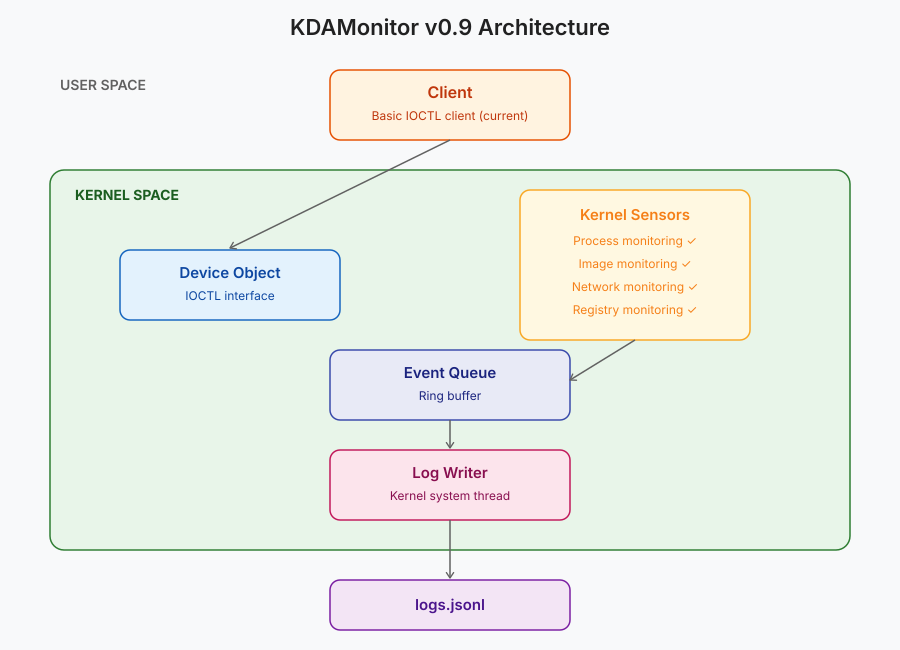

Bienvenue dans le neuvième article de la série sur le développement de KDAMonitor !

Dans cet article, je vais couvrir la version v0.9 de ce projet. Dans cette version, j'implémente le quatrième capteur du projet : le capteur d'activité du registre.

Voici les fichiers concernés par cet article, et la section qui les explique :

| Fichier | Rôle | Section |
| --- | --- | --- |
| `event_types.h` | Nouveau type `KDAMON_REGISTRY_EVENT_DATA` + enum `KDAMON_REGISTRY_ACTION` + union dans `KDAMON_EVENT` | [Que récupérer lors d'un événement registre ?](#que-récupérer-lors-dun-événement-registre-) |
| `kdamon_config.h` | Constantes de configuration du capteur registre | [Que récupérer lors d'un événement registre ?](#que-récupérer-lors-dun-événement-registre-) |
| `registry_callback.h` | Déclaration du register/unregister | [Implémenter le callback](#implémenter-le-callback) |
| `registry_callback.c` | Le callback lui-même | [Implémenter le callback](#implémenter-le-callback) |
| `log_writer.c` | Sérialisation JSONL spécifique aux événements de registre | [Sérialiser les événements registre en JSONL](#sérialiser-les-événements-registre-en-jsonl) |
| `driver_entry.c` | Enregistrement/désenregistrement du callback au chargement/déchargement | [Intégration dans `driver_entry.c`](#intégration-dans-driver_entryc) |

> Le projet peut être retrouvé dans ce dépôt : [KDAMonitor](https://github.com/HalfTimeOfLife/KDAMonitor).

---

## Que récupérer lors d'un événement registre ?

Comme pour chaque article qui concerne un capteur, on commence par lister ce que notre événement doit contenir, voici ce qui a été retenu :

- l'ID du processus intéragissant avec un registre (`HANDLE ProcessId`)
- le chemin vers le processus intéragissant avec un registre (`WCHAR ProcessPath[KDAMON_REG_PATH_MAX];`)
- l'action effectuée (`KDAMON_REGISTRY_ACTION Action`), c'est-à-dire ce que le processus a fait :

  - défini (créé ou modifié) une valeur dans une clef du registre
  - supprimé une valeur d'une clef du registre
  - créé ou ouvert une clef dans le registre

> L'action effectuée est représentée par une enum :

```c
typedef enum _KDAMON_REGISTRY_ACTION
{
    KDAMON_REGISTRY_ACTION_SET_VALUE,
    KDAMON_REGISTRY_ACTION_DELETE_VALUE,
    KDAMON_REGISTRY_ACTION_CREATE_KEY,
} KDAMON_REGISTRY_ACTION;
```

- le chemin de la clef concernée (`WCHAR KeyPath[KDAMON_REG_PATH_MAX];`)
- le nom de la valeur concernée (`WCHAR ValueName[KDAMON_REG_VALUENAME_MAX];`)
- le type de la valeur (`ULONG ValueType;`)
- le contenu de la valeur (`UCHAR ValueData[KDAMON_REG_VALUEDATA_MAX];`)
- la taille du contenu de la valeur (`ULONG ValueDataSize;`)
- le statut à l'issue de l'opération (`NTSTATUS Status;`), uniquement renseigné pour la création de clef

---

## Implémenter le callback

Tout le code présenté dans cette partie est dans le fichier `registry_callback.c`. Contrairement aux capteurs précédents, on n'enregistre pas une routine par type d'événement. On va utiliser `CmRegisterCallbackEx` qui enregistre une unique routine qui reçoit toutes les opérations du registre. Il faut ensuite qu'on décide à quelle(s) opération(s) on souhaite réagir.

Deux fonctions sont exposées dans le header :

- `NTSTATUS KdaMonRegistryCallbackRegister(_In_ PDRIVER_OBJECT DriverObject);` : enregistre le callback. Elle prend en plus le `DriverObject`, exigé par `CmRegisterCallbackEx`
- `VOID KdaMonRegistryCallbackUnregister(VOID);` : désenregistre le callback

Le reste est privé :

- `KdaMonRegistryCallback` : la routine enregistrée, qui joue le rôle de dispatcher
- `KdaMonRegistryHandleSetValueKey`, `KdaMonRegistryHandleDeleteValueKey`, `KdaMonRegistryHandlePostCreateKeyEx` : un handler par action
- `KdaMonRegistryResolveKeyPath`, `KdaMonRegistryResolveProcessPath` : deux helpers qui résolvent les chemins

> Voir la documentation Microsoft pour [EX_CALLBACK_FUNCTION](https://learn.microsoft.com/en-us/windows-hardware/drivers/ddi/wdm/nc-wdm-ex_callback_function) et [CmRegisterCallbackEx](https://learn.microsoft.com/en-us/windows-hardware/drivers/ddi/wdm/nf-wdm-cmregistercallbackex).

### Enregistrer et désenregistrer le callback

```c
LARGE_INTEGER g_RegistryCookie = { 0 };

...
 
NTSTATUS KdaMonRegistryCallbackRegister(_In_ PDRIVER_OBJECT DriverObject) 
{
    NTSTATUS status;
    UNICODE_STRING altitude;

    RtlInitUnicodeString(&altitude, KDAMON_REG_ALTITUDE);

    status = CmRegisterCallbackEx(
        KdaMonRegistryCallback,
        &altitude,
        DriverObject,
        NULL,
        &g_RegistryCookie,
        NULL
    );
    if (!NT_SUCCESS(status))
    {
        KdPrint((DRIVER_TAG " [ERROR]: CmRegisterCallbackEx failed: 0x%X\n", status));
        return status;
    }

    KdPrint((DRIVER_TAG " [SUCCESS]: Registry callback registered\n"));
    return STATUS_SUCCESS;
}
```

- `KdaMonRegistryCallback` : la routine appelée à chaque opération sur le registre
- `altitude` : une chaîne qui définit la position du callback dans la chaîne des filtres registre (`KDAMON_REG_ALTITUDE`, `360000`)
- `&g_RegistryCookie` : un identifiant retourné par le noyau pour cet enregistrement

Le cookie est global car il sert au désenregistrement et à la résolution du chemin des clefs (voir plus bas).

```c
VOID KdaMonRegistryCallbackUnregister(VOID)
{
    if (g_RegistryCookie.QuadPart != 0)
    {
        CmUnRegisterCallback(g_RegistryCookie);
        g_RegistryCookie.QuadPart = 0;
        KdPrint((DRIVER_TAG " [SUCCESS]: Registry callback unregistered\n"));
    }
}
```

Le test sur `QuadPart` évite de désenregistrer un callback qui n'a jamais été enregistré.

### Le dispatcher

```c
static NTSTATUS KdaMonRegistryCallback(_In_ PVOID CallbackContext, _In_opt_ PVOID Argument1, _In_opt_ PVOID Argument2)
{
    UNREFERENCED_PARAMETER(CallbackContext);

    REG_NOTIFY_CLASS notifyClass = (REG_NOTIFY_CLASS)(ULONG_PTR)Argument1;

    switch (notifyClass)
    {
    case RegNtPreSetValueKey:
        KdaMonRegistryHandleSetValueKey((PREG_SET_VALUE_KEY_INFORMATION)Argument2);
        break;

    case RegNtPreDeleteValueKey:
        KdaMonRegistryHandleDeleteValueKey((PREG_DELETE_VALUE_KEY_INFORMATION)Argument2);
        break;

    case RegNtPostCreateKeyEx:
        KdaMonRegistryHandlePostCreateKeyEx((PREG_POST_OPERATION_INFORMATION)Argument2);
        break;

    default:
        break;
    }

    return STATUS_SUCCESS;
}
```

`Argument1` contient la classe de l'opération (`REG_NOTIFY_CLASS`). `Argument2` pointe vers une structure dont le type dépend de cette classe, on la cast donc dans chaque `case`. Les trois classes gérées sont :

| Classe | Structure | Moment |
| --- | --- | --- |
| `RegNtPreSetValueKey` | `REG_SET_VALUE_KEY_INFORMATION` | Avant l'écriture de la valeur |
| `RegNtPreDeleteValueKey` | `REG_DELETE_VALUE_KEY_INFORMATION` | Avant la suppression de la valeur |
| `RegNtPostCreateKeyEx` | `REG_POST_OPERATION_INFORMATION` | Après la création de la clef |

Les deux premières sont des notifications *Pre*, ce qui signifie que le callback est appelé avant l'opération, avec les informations de la valeur, mais sans connaître son résultat. La dernière est une notification *Post*, l'opération est terminée, ce qui donne accès à son `Status`.

Le callback retourne toujours `STATUS_SUCCESS`. Retourner une erreur depuis une notification *Pre* bloquerait l'opération.

> `RegNtPostCreateKeyEx` est notifié pour tout appel à `ZwCreateKey`, qui crée la clef ou ouvre une clef déjà existante.

### Résolution du chemin de la clef

```c
static NTSTATUS KdaMonRegistryResolveKeyPath(_In_ PVOID Object, _Out_writes_bytes_(KeyPathBufferSize) PWCHAR KeyPathBuffer, _In_ ULONG KeyPathBufferSize)
{
    NTSTATUS status;
    PCUNICODE_STRING ObjectName = NULL;

    KeyPathBuffer[0] = L'\0';

    if (Object == NULL)
    {
        return STATUS_INVALID_PARAMETER;
    }

    status = CmCallbackGetKeyObjectIDEx(
        &g_RegistryCookie,
        Object,
        NULL,
        &ObjectName,
        0
    );
    if (!NT_SUCCESS(status) || ObjectName == NULL)
    {
        return status;
    }

    ULONG charsToCopy = min(ObjectName->Length / sizeof(WCHAR), KeyPathBufferSize - 1);
    RtlCopyMemory(KeyPathBuffer, ObjectName->Buffer, charsToCopy * sizeof(WCHAR));
    KeyPathBuffer[charsToCopy] = L'\0';

    CmCallbackReleaseKeyObjectIDEx(ObjectName);

    return STATUS_SUCCESS;
}
```

Les structures reçues contiennent un pointeur vers l'objet clef mais pas son chemin. `CmCallbackGetKeyObjectIDEx` retourne ce chemin (de la forme `\REGISTRY\MACHINE\...`) dans un `UNICODE_STRING` alloué par le système, qu'il faut libérer avec `CmCallbackReleaseKeyObjectIDEx` une fois la copie faite.

La copie utilise la même troncature sécurisée que dans les articles précédents. Le buffer est mis à vide dès le départ et si la résolution échoue, l'événement obtient un chemin vide.

### Résolution du chemin du processus
 
```c
NTKERNELAPI
NTSTATUS SeLocateProcessImageName(_In_ PEPROCESS Process, _Out_ PUNICODE_STRING* pImageFileName);
```
 
`SeLocateProcessImageName` est exportée par le noyau mais n'est pas déclarée dans les en-têtes du WDK : on écrit donc le prototype à la main en haut du fichier.
 
```c
static NTSTATUS KdaMonRegistryResolveProcessPath(_Out_writes_z_(Length) PWCHAR Buffer, _In_ ULONG Length)
{
    NTSTATUS status;
    PUNICODE_STRING imageName = NULL;

    Buffer[0] = L'\0';

    status = SeLocateProcessImageName(PsGetCurrentProcess(), &imageName);
    if (!NT_SUCCESS(status) || imageName == NULL)
    {
        return status;
    }

    ULONG charsToCopy = min(imageName->Length / sizeof(WCHAR), Length - 1);
    RtlCopyMemory(Buffer, imageName->Buffer, charsToCopy * sizeof(WCHAR));
    Buffer[charsToCopy] = L'\0';

    ExFreePool(imageName);

    return STATUS_SUCCESS;
}
```

Le callback s'exécute dans le contexte du thread qui effectue l'opération, `PsGetCurrentProcess()` est donc le processus qui touche au registre.

### Les trois handlers
 
Les trois handlers suivent le même squelette :
 
1. créer l'événement et son timestamp
2. remplir le PID (`PsGetCurrentProcessId()`) et le chemin du processus
3. remplir l'action et le chemin de la clef
4. remplir les champs propres à l'action
5. pousser l'événement dans la file

Par exemple, voici `KdaMonRegistryHandleSetValueKey` en entier :

```c
static VOID KdaMonRegistryHandleSetValueKey(_In_opt_ PREG_SET_VALUE_KEY_INFORMATION Info)
{
    if (Info == NULL || Info->ValueName == NULL)
    {
        return;
    }

    KDAMON_EVENT Event = { 0 };
    Event.Type = KdaMonEventRegistry;
    KeQuerySystemTimePrecise(&Event.Timestamp);

    Event.Data.Registry.ProcessId = PsGetCurrentProcessId();
    KdaMonRegistryResolveProcessPath(
        Event.Data.Registry.ProcessPath,
        RTL_NUMBER_OF(Event.Data.Registry.ProcessPath)
    );

    Event.Data.Registry.Action = KDAMON_REGISTRY_ACTION_SET_VALUE;

    KdaMonRegistryResolveKeyPath(
        Info->Object,
        Event.Data.Registry.KeyPath,
        RTL_NUMBER_OF(Event.Data.Registry.KeyPath)
    );

    ULONG nameChars = min(
        Info->ValueName->Length / sizeof(WCHAR),
        RTL_NUMBER_OF(Event.Data.Registry.ValueName) - 1
    );
    RtlCopyMemory(Event.Data.Registry.ValueName, Info->ValueName->Buffer, nameChars * sizeof(WCHAR));
    Event.Data.Registry.ValueName[nameChars] = L'\0';

    Event.Data.Registry.ValueType = Info->Type;

    ULONG dataSize = min(Info->DataSize, KDAMON_REG_VALUEDATA_MAX);
    if (Info->Data != NULL && dataSize > 0)
    {
        RtlCopyMemory(Event.Data.Registry.ValueData, Info->Data, dataSize);
    }
    Event.Data.Registry.ValueDataSize = dataSize;

    KdaMonEventQueuePush(&Event);
}
```

Les données de la valeur sont tronquées à `KDAMON_REG_VALUEDATA_MAX` octets, et `ValueDataSize` contient la taille copiée.

Les deux autres handlers ne diffèrent que sur l'étape 4 :

- `KdaMonRegistryHandleDeleteValueKey` (`PREG_DELETE_VALUE_KEY_INFORMATION`) : seul le nom de la valeur est copié, `ValueType` et `ValueDataSize` valent 0
- `KdaMonRegistryHandlePostCreateKeyEx` (`PREG_POST_OPERATION_INFORMATION`) : pas de nom de valeur et c'est le seul handler qui récupère le résultat de l'opération avec `Event.Data.Registry.Status = Info->Status;`

> Les codes complets de `KdaMonRegistryHandleDeleteValueKey` et `KdaMonRegistryHandlePostCreateKeyEx` peuvent être trouvés dans le fichier [`KDAMonitor/driver/src/registry_callback.c`](https://github.com/HalfTimeOfLife/KDAMonitor/blob/main/driver/src/registry_callback.c).

---

## Sérialiser les événements registre en JSONL

Voici la fonction dédiée à la sérialisation des événements concernant les registres :

```c
static NTSTATUS KdaMonLogWriterWriteRegistryEvent(_In_ const KDAMON_EVENT* Event, _Out_writes_z_(BufferSize) PSTR EventBuffer, _In_ SIZE_T BufferSize)
{
    CHAR EscapedKeyPath[520];
    CHAR EscapedValueName[520];
    CHAR FormattedValueData[600];
    CHAR StatusField[16];

    const char* action;

    if (!KdaMonJsonEscapeW(Event->Data.Registry.KeyPath, EscapedKeyPath, sizeof(EscapedKeyPath)))
    {
        KdPrint((DRIVER_TAG " [WARNING]: KeyPath truncated during JSON escape (event %lu)\n", Event->Id));
    }

    switch (Event->Data.Registry.Action)
    {
    case KDAMON_REGISTRY_ACTION_SET_VALUE:
    {
        action = "set_value";
        break;
    }
    case KDAMON_REGISTRY_ACTION_DELETE_VALUE:
    {
        action = "delete_value";
        break;
    }
    case KDAMON_REGISTRY_ACTION_CREATE_KEY:
    {
        action = "create_key";
        break;
    }
    default: 
    {
        action = "unknown";
        break;
    }
    }

    if (Event->Data.Registry.Action == KDAMON_REGISTRY_ACTION_CREATE_KEY)
    {
        RtlStringCbCopyA(EscapedValueName, sizeof(EscapedValueName), "");
        RtlStringCbCopyA(FormattedValueData, sizeof(FormattedValueData), "null");
    }
    else
    {
        if (!KdaMonJsonEscapeW(Event->Data.Registry.ValueName, EscapedValueName, sizeof(EscapedValueName)))
        {
            KdPrint((DRIVER_TAG " [WARNING]: ValueName truncated during JSON escape (event %lu)\n", Event->Id));
        }

        if (Event->Data.Registry.Action == KDAMON_REGISTRY_ACTION_SET_VALUE)
        {
            KdaMonRegistryFormatValueData(&Event->Data.Registry, FormattedValueData, sizeof(FormattedValueData));
        }
        else
        {
            RtlStringCbCopyA(FormattedValueData, sizeof(FormattedValueData), "null");
        }
    }

    if (Event->Data.Registry.Action == KDAMON_REGISTRY_ACTION_CREATE_KEY)
    {
        RtlStringCbPrintfA(StatusField, sizeof(StatusField), "\"0x%08X\"", (ULONG)Event->Data.Registry.Status);
    }
    else
    {
        RtlStringCbCopyA(StatusField, sizeof(StatusField), "null");
    }

    return RtlStringCbPrintfA(
        EventBuffer,
        BufferSize,
        "{\"id\":%lu,\"type\":\"%s\",\"timestamp\":%lld,"
        "\"pid\":%lu,\"action\":\"%s\","
        "\"key_path\":\"%s\",\"value_name\":\"%s\",\"value_data\":%s,"
        "\"status\":%s}\n",
        Event->Id,
        KdaMonEventTypeToString(Event->Type),
        Event->Timestamp.QuadPart,
        (ULONG)(ULONG_PTR)Event->Data.Registry.ProcessId,
        action,
        EscapedKeyPath,
        EscapedValueName,
        FormattedValueData,
        StatusField
    );
}
```

Voici, brièvement, le déroulement de la fonction `KdaMonLogWriterWriteRegistryEvent` :

1. On échappe le chemin de la clef avec `KdaMonJsonEscapeW`.
2. On convertit l'action en chaîne (`set_value`, `delete_value` ou `create_key`).
3. On prépare les champs qui dépendent de l'action :
   - `create_key` : pas de nom ni de contenu de valeur (`value_data` vaut `null`)
   - `set_value` : le nom de la valeur est échappé et son contenu formaté par `KdaMonRegistryFormatValueData`
   - `delete_value` : le nom de la valeur est échappé, `value_data` vaut `null`
4. Le statut n'a de sens que pour `create_key` (notification *Post*), pour les autres actions, il vaut `null`.
5. On remplit le buffer `EventBuffer` avec les informations de l'événement.

`KdaMonRegistryFormatValueData` choisit le format du champ `value_data` d'après `ValueType` (le détail de cette fonction ne sera pas montré ici, voir [log_writer.c](https://github.com/HalfTimeOfLife/KDAMonitor/blob/main/driver/src/log_writer.c)) :

| Type | Format dans le JSON |
| --- | --- |
| `REG_SZ`, `REG_EXPAND_SZ` | chaîne échappée entre guillemets |
| `REG_DWORD`, `REG_QWORD` | nombre décimal |
| tous les autres (`REG_BINARY`, `REG_MULTI_SZ`, ...) | chaîne hexadécimale entre guillemets |
 
Les contenus binaires sont tronqués à `KDAMON_REG_VALUEDATA_MAX` octets, comme à la capture.
 
Il ne reste plus qu'à appeler cette fonction dans le `switch` de `KdaMonLogWriterWriteEvent` :
 
```c
case KdaMonEventRegistry:
    status = KdaMonLogWriterWriteRegistryEvent(Event, EventBuffer, sizeof(EventBuffer));
    break;
```

Les lignes d'événement registre auront les formes suivantes :

```json
{"id":20,"type":"registry","timestamp":134303322704667968,"pid":4836,"action":"create_key","key_path":"\\REGISTRY\\MACHINE\\SOFTWARE\\KDAMonitorTest","value_name":"","value_data":null,"status":"0x00000000"}
{"id":21,"type":"registry","timestamp":134303322704668353,"pid":4836,"action":"set_value","key_path":"\\REGISTRY\\MACHINE\\SOFTWARE\\KDAMonitorTest","value_name":"StringValue","value_data":"hello","status":null}
{"id":109,"type":"registry","timestamp":134303322707340091,"pid":3584,"action":"delete_value","key_path":"\\REGISTRY\\MACHINE\\SOFTWARE\\KDAMonitorTest","value_name":"StringValue","value_data":null,"status":null}
```

> Au passage, le `ProcessId` des événements réseau est passé de `ULONG` à `HANDLE` dans cette version, pour rester cohérent avec les autres capteurs.

---

## Intégration dans `driver_entry.c`

Ce capteur est le dernier enregistré, et le premier désenregistré.

Donc dans `DriverUnload` :

```c
void DriverUnload(_In_ PDRIVER_OBJECT DriverObject)
{
	UNREFERENCED_PARAMETER(DriverObject);

	KdPrint((DRIVER_TAG " [INFO]: Driver Unload begin\n"));

	// --- Unregister callbacks ---
	KdaMonRegistryCallbackUnregister();
	KdaMonImageCallbackUnregister();
	KdaMonProcessCallbackUnregister();

	// --- Stop the log writer ---
	KdaMonLogWriterStop();

	// --- Destroy the event queue ---
	KdaMonEventQueueDestroy();

	// --- Cleanup WFP callout ---
	KdaMonWfpCalloutUnregister();

	// --- Cleanup WFP session ---
	KdaMonWfpSessionCleanup();

	// --- Delete device object ---
	KdaMonDeleteDevice(&g_DeviceObject);
	KdPrint((DRIVER_TAG " [INFO]: Driver Unload complete\n"));
}
```

Dans `DriverEntry`, on l'enregistre après l'enregistrement du callback des images :

```c
	// --- Register image load callback ---
  ...
	// --- Register registry callback ---
	status = KdaMonRegistryCallbackRegister(DriverObject);
	if (!NT_SUCCESS(status))
	{
		KdPrint((DRIVER_TAG " [ERROR]: KdaMonRegistryCallbackRegister failed\n"));
		goto cleanup_image;
	}

	KdPrint((DRIVER_TAG " [INFO]: Initialized successfully\n"));
	return STATUS_SUCCESS;
```

---

## Validation

Le test doit couvrir les trois actions et les principaux types de valeur. Voici `test_v09.ps1` :

```powershell
# test_v09.ps1

$Driver = "KDAMonitor"
$DriverPath = "$env:USERPROFILE\Desktop\$Driver.sys"
$TestKey = "HKLM\SOFTWARE\KDAMonitorTest"

sc.exe stop $Driver
sc.exe delete $Driver

sc.exe create $Driver type= kernel binPath= $DriverPath
sc.exe start $Driver

reg add $TestKey /f

reg add $TestKey /v StringValue /t REG_SZ /d "hello" /f
reg add $TestKey /v ExpandValue /t REG_EXPAND_SZ /d "%TEMP%" /f
reg add $TestKey /v DwordValue /t REG_DWORD /d 42 /f
reg add $TestKey /v QwordValue /t REG_QWORD /d 42 /f
reg add $TestKey /v BinaryValue /t REG_BINARY /d deadbeef /f

reg delete $TestKey /v StringValue /f
reg delete $TestKey /f

sc.exe stop $Driver
sc.exe delete $Driver
```

Le premier `reg add` sur la clef seule déclenche `create_key` ; les cinq suivants déclenchent `set_value`, un par type de valeur géré par `KdaMonRegistryFormatValueData` ; les deux `reg delete` couvrent `delete_value` puis la suppression de la clef elle-même, cette dernière n'est pas capturée par le capteur car il ne suit que les valeurs.

Voici une démonstration de ce test en exécution :

<video controls width="100%">
  <source src="demo-registry-sensor.mp4" type="video/mp4">
</video>

En filtrant le journal sur le nom de la clef de test, on retrouve les douze événements produits par le script : six `create_key` (un par commande `reg add`, la clef étant déjà présente dès la deuxième), cinq `set_value` avec le format attendu pour chaque type testé, et un `delete_value` pour la valeur explicitement supprimée en fin de script.

```powershell
Select-String -Path "C:\KDAMonitor\logs\*.jsonl" -Pattern "KDAMonitorTest" -SimpleMatch
```

```
C:\KDAMonitor\logs\kdamon_20260804_155110.jsonl:10:{"id":9,"type":"Registry","timestamp":134303322704282678,"pid":11028,"action":"create_key","key_path":"\REGISTRY\MACHINE\SOFTWARE\KDAMonitorTest","value_name":"","value_data":null,"status":"0x00000000"}
C:\KDAMonitor\logs\kdamon_20260804_155110.jsonl:11:{"id":10,"type":"Registry","timestamp":134303322704283042,"pid":11028,"action":"set_value","key_path":"\REGISTRY\MACHINE\SOFTWARE\KDAMonitorTest","value_name":"","value_data":"","status":null}
C:\KDAMonitor\logs\kdamon_20260804_155110.jsonl:21:{"id":20,"type":"Registry","timestamp":134303322704667968,"pid":4836,"action":"create_key","key_path":"\REGISTRY\MACHINE\SOFTWARE\KDAMonitorTest","value_name":"","value_data":null,"status":"0x00000000"}
C:\KDAMonitor\logs\kdamon_20260804_155110.jsonl:22:{"id":21,"type":"Registry","timestamp":134303322704668353,"pid":4836,"action":"set_value","key_path":"\REGISTRY\MACHINE\SOFTWARE\KDAMonitorTest","value_name":"StringValue","value_data":"hello","status":null}
C:\KDAMonitor\logs\kdamon_20260804_155110.jsonl:32:{"id":31,"type":"Registry","timestamp":134303322705186483,"pid":3796,"action":"create_key","key_path":"\REGISTRY\MACHINE\SOFTWARE\KDAMonitorTest","value_name":"","value_data":null,"status":"0x00000000"}
C:\KDAMonitor\logs\kdamon_20260804_155110.jsonl:33:{"id":32,"type":"Registry","timestamp":134303322705186841,"pid":3796,"action":"set_value","key_path":"\REGISTRY\MACHINE\SOFTWARE\KDAMonitorTest","value_name":"ExpandValue","value_data":"%TEMP%","status":null}
C:\KDAMonitor\logs\kdamon_20260804_155110.jsonl:77:{"id":76,"type":"Registry","timestamp":134303322706094293,"pid":1048,"action":"create_key","key_path":"\REGISTRY\MACHINE\SOFTWARE\KDAMonitorTest","value_name":"","value_data":null,"status":"0x00000000"}
C:\KDAMonitor\logs\kdamon_20260804_155110.jsonl:78:{"id":77,"type":"Registry","timestamp":134303322706095212,"pid":1048,"action":"set_value","key_path":"\REGISTRY\MACHINE\SOFTWARE\KDAMonitorTest","value_name":"DwordValue","value_data":42,"status":null}
C:\KDAMonitor\logs\kdamon_20260804_155110.jsonl:88:{"id":87,"type":"Registry","timestamp":134303322706480125,"pid":608,"action":"create_key","key_path":"\REGISTRY\MACHINE\SOFTWARE\KDAMonitorTest","value_name":"","value_data":null,"status":"0x00000000"}
C:\KDAMonitor\logs\kdamon_20260804_155110.jsonl:89:{"id":88,"type":"Registry","timestamp":134303322706481009,"pid":608,"action":"set_value","key_path":"\REGISTRY\MACHINE\SOFTWARE\KDAMonitorTest","value_name":"QwordValue","value_data":42,"status":null}
C:\KDAMonitor\logs\kdamon_20260804_155110.jsonl:99:{"id":98,"type":"Registry","timestamp":134303322706957224,"pid":7816,"action":"create_key","key_path":"\REGISTRY\MACHINE\SOFTWARE\KDAMonitorTest","value_name":"","value_data":null,"status":"0x00000000"}
C:\KDAMonitor\logs\kdamon_20260804_155110.jsonl:100:{"id":99,"type":"Registry","timestamp":134303322706958245,"pid":7816,"action":"set_value","key_path":"\REGISTRY\MACHINE\SOFTWARE\KDAMonitorTest","value_name":"BinaryValue","value_data":"deadbeef","status":null}
C:\KDAMonitor\logs\kdamon_20260804_155110.jsonl:110:{"id":109,"type":"Registry","timestamp":134303322707340091,"pid":3584,"action":"delete_value","key_path":"\REGISTRY\MACHINE\SOFTWARE\KDAMonitorTest","value_name":"StringValue","value_data":null,"status":null}
```

---

## Conclusion

L'avant-dernier capteur est fait ! KDAMonitor journalise maintenant les processus, les chargements d'images, les connexions réseau et l'activité du registre. On approche de la fin de ce projet petit à petit...

Voici l'architecture mise à jour :



Merci d'avoir lu jusqu'au bout et à bientôt pour le prochain et dixième article de cette série : **Surveillance de la création et de la terminaison des threads**.
